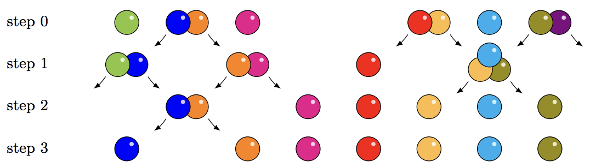

## 문제

At the national centre for computing and advanced circus skills, technical demonstrations by students are strongly encouraged.

A troupe of n novice performers are at this very moment arrayed in a row attempting to put on a juggling show. Unfortunately, none of them are very confident in their craft, and they are struggling. Thus, as soon as an opportunity presents itself, they will try to reduce their part in the performance to make the task easier.

Whenever a juggler has more than one ball in their possession, they will throw one ball to each of their neighbours. In the case that a juggler does not have a neighbour in some direction, they will simply throw the ball offstage instead. Everybody throws their juggling balls simultaneously. The show ends when no juggler has more than one ball.

See Figure J.1 below for an illustration of this process.

Figure J.1: Illustration of Sample Input 1. A performance with n = 8 jugglers.

As a member of the audience, you are not impressed by this performance. However, you do wonder how many balls each of the jugglers will have left at the end of the show.

## 입력

The input consists of:

* One line with a string s of length n (1 ≤ n ≤ 106) over the characters 0, 1 and 2. The ith character in s represents the number of juggling balls initially held by the ith person.

## 출력

Output a string s of length n over the characters 0 and 1, the ith giving the number of juggling balls the ith person has at the end of the show.
