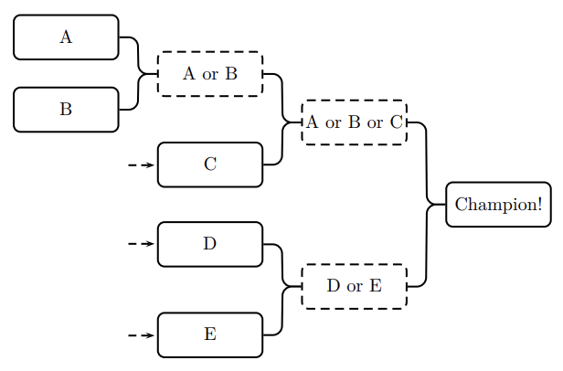

## 문제

Laura is organising a knockout tournament, in which her friend Dale takes part. Laura would like to maximise the probability of Dale winning the tournament by arranging the games in a favourable way. She does not know how to do it, so she asked you for help. Naturally, you refuse to cooperate with such a deplorable act—but then you realise that it is a very nice puzzle!

When the number of players is a power of two, the tournament setup can be described recursively as follows: the players are divided into two equal groups that each play their own knockout tournament, after which the winners of both tournaments play each other. Once a player loses, they are out of the tournament.

When the number of players is not a power of two, some of the last players in the starting line-up advance from the first round automatically so that in the second round the number of players left is a power of two, as shown in Figure K.1.

Figure K.1: A tournament tree with 5 players. Players C, D, and E advance from the first round automatically.

Every player has a rating indicating their strength. A player with rating a wins a game against a player with rating b with probability a/(a+b) (independently of any previous matches played).

Laura as the organiser can order the starting line-up of players in any way she likes. What is the maximum probability of Dale winning the tournament?

## 입력

The input consists of:

* One line with an integer n (2 ≤ n ≤ 4096), the total number of players.
* n lines, each with an integer r (1 ≤ r ≤ 105), the rating of a player. The first rating given is Dale’s rating.

## 출력

Output the maximum probability with which Dale can win the tournament given a favourable setup. Your answer should have an absolute or relative error of at most 10−6.
