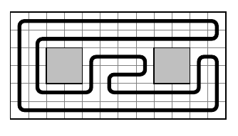

## 문제

Byteasar holds the administrating manager position at a large warehouse. Anticipating a severe winter, he decided to install underfloor heating system in the warehouse.

Warehouse plan is a rectangle of even dimensions n × m divided into individual square units. Most of the individual squares comprise warehouse space, but some of it is occupied by massive pillars providing additional constructional support for the warehouse structure. Each pillar occupies a square 2 × 2 on the warehouse plan, composed of individual square units. Pillars are not arranged too densely-is known that any two of them are separated by at least 6 units (in Euclidean metric). Additionally, the centre of each pillar is located at least by 3 units away from each of the outer warehouse walls.

Heating will be accomplished by using one heating pipe installed under the floor of the warehouse. The pipe is to run through the centres of all individual square units except the square units occupied by pillars. Each pipe section must run parallel to one of the walls of the hall and the turns could be located only at the centres of the square units. The pipe must begin and end in the same place. At this point the cold water would be discharged outside and hot water fed into the pipe.

Byteasar has asked you to plan the pipe trajectory in the warehouse. To help you, he introduced rectangular coordinate system onto the warehouse plan, where the abscissae belong to the interval [0, n], and ordinates to the interval [0, m]. The coordinates of the centres of all individual square units are numbers in the form k + 1/2 dla k ∈ ℕ.

## 입력

The first line of input contains three integers n, m and f (1 ≤ n, m ≤ 1,000 and n and m are even) indicating the warehouse dimensions and the number of the pillars. Each of the next f lines contains two integers xi and yi (0 ≤ xi ≤ n, 0 ≤ yi ≤ m) denoting the coordinates of the centre of the i-th pillar.

## 출력

In the first line of output your program should produce one word `TAK` (i.e., *yes*) or `NIE` (i.e., *no*) depending on whether the implementation of floor heating in line with Byteasar's requirements is achievable, or not. In case the answer is `TAK`, the second line should contain a description of the exemplary plan of the pipe trajectory in the form of a string of nm - 4f letters. We agree to assume that the beginning of the pipe is located at the point with the coordinates (1/2, 1/2). Following parts of the pipe are marked as follows: transition by the vector [0, 1] is denoted by a letter `G`, by the vector [0, -1] is denoted by `D`, by the vector [1, 0] is denoted by `P`, and by the vector [-1, 0] is denoted by `L`. In case there are multiple correct answers, your program should output any of them.

## 힌트

Example output corresponds to the following figure:

