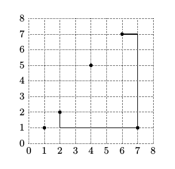

## 문제

Captain Byteasar compasses the waters of Byteic Sea together with his irreplaceable First Officer Bytec. There are n islands in the Byteic Sea, which we numbered from 1 to n. Captain's ship has docked at the island number 1. Captain's expedition plan is to sail to the island number n.

During the voyage, the ship always moves in one of four directions of the world: north, south, east or west. At any time it is either the Captain or the First Officer standing at the helm. Every time the ship will perform 90° turn, they would change at the helm.

Along its way, the vessel may stop at other islands. After each stop, the Captain can decide whether he takes control of the helm first, or not. In other words, for each route leg, leading from an island to another one, one of the sailors stands at the helm while the ship is travelling north or south, and the other controls it while it is moving east or west. In particular, if a given fragment of the route runs exactly in one of the four directions of the world, the ship is controlled by only one of the sailors.

The captain is now considering how to plan a route of the forthcoming voyage and how to divide labour in such a way to spend as little time at the helm. At the same time the Captain does not care how long the calculated route would be. It is assumed that the vessel is sailing at a constant rate of one unit per hour.

## 입력

The first line of input contains a single integer n (2 ≤ n ≤ 200,000) denoting the number of islands in the sea. For simplicity, we introduce a coordinate system onto Byteic Sea with axes parallel to the directions of the world. Every island is represented as a single point. Subsequent n lines contain descriptions of the islands: i-th line contains two integers xi, yi (0 ≤ xi ≤ yi ≤ 1,000,000,000) denoting the coordinates of i-th island in the sea. Each island bears different coordinates.

## 출력

Your program should output a single integer denoting the least number of hours the Captain will have to steer the ship on the route from the island number 1 to the number n.

## 힌트

The Captain may designate a route that is indicated in the figure. During the voyage from island 1 (coordinates: (2, 2)) to the island 4 (coordinates: (7, 1)) the Captain controls the ship only for an hour, while the ship is sailing south. During the second leg of the trip the Captain controls the vessel only when it is moving east.
