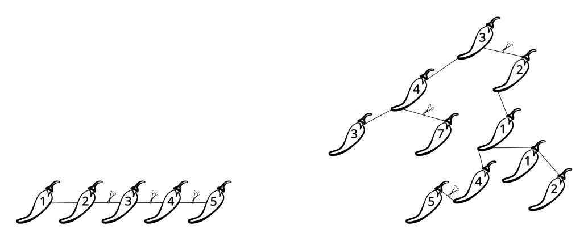

## 문제

Krešo went to a local family farm and bought a bunch of hot peppers that are neatly connected with pieces of string into a so-called wreath. In this task, a wreath consists of n peppers and (n − 1) pieces of string. Each piece of string connects two different peppers, and each two peppers in the wreath are connected (directly or indirectly) by the string. Therefore, the peppers and pieces of string form a so-called tree. Making one cut with scissors, Krešo can cut the string, and split a pepper wreath into two smaller wreaths, which can again be split into smaller wreaths, and so on. Notice that a single pepper not connected to anything also forms a wreath.

Figure 1: The initial wreaths from the first two test cases together with the optimal cuts.

The spiciness of a single peper is measured using the so-called Scoville scale, and is represented as a non-negative integer. The spiciness of the wreath is the sum of spiciness of individual peppers it contains. Krešo wants to spice up the lunch of high school students after an informatics competition and knows that the average high school student can eat a wreath whose spiciness is at most k before they need to ask for a doctor and a juvenile lawyer.

Determine the minimal number of cuts needed so that Krešo can split the initial wreath into wreaths with spiciness at most k.

## 입력

The first line of input contains the integers n and k — the number of peppers and the maximal allowed spiciness of an individual wreath. The peppers are denoted with numbers from 1 to n. The following line contains n integers h1, h2, . . . , hn — the number hj is the spiciness of pepper j. Each of the following n − 1 lines contains two distinct integers x and y (1 ≤ x, y ≤ n) — the labels of the peppers directly connected with a piece of string in the initial wreath. The peppers and strings form a tree, as described in the task.

## 출력

You must output the minimal number of cuts.
