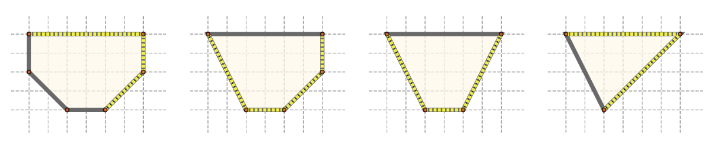

## 문제

In a plane, if we have a convex polygon P, and we place a source of light at a point T located outside the polygon, it lights up some edges of P — if A and B are two consecutive polygon vertices, then the edge AB is lit up if the area of the triangle 4T AB is not zero, and if it doesn’t intersect the inside of the polygon. The brightness of the polygon is the sum of the lengths of lit up edges, and the maximal brightness of a polygon is the maximal possible brightness we can achieve if we select an optimal point T. The distance between point T and the polygon can be arbitrary, and the coordinates of point T don’t necessarily need to be integers.

Figure 4: Polygons P, P1, P2 and P3 from the second test case, the optimal brightness is marked.

You are given a convex polygon P whose vertices are, respectively, points A1, A2, . . . , An. The polygon is changed in q steps — in the jth step, we delete an existing polygon vertex, and obtain a new polygon Pj. More precisely, the vertices of polygon Pj are the vertices of P that haven’t been deleted yet, and their order is the same as in polygon P. It is easy to see that each polygon Pj is convex too.

Determine the maximal brightness of the polygon P and each of the obtained polygons P1, P2, . . . , Pq.

## 입력

The first line of input contains the positive integer n — the number of vertices of the initial polygon P. The jth of the following n lines contains two integers xj and yj (−109 ≤ xj, yj ≤ 109) — the coordinates of vertex Aj. The following line contains the integer q (0 ≤ q ≤ n − 3) — the number of steps. The jth of the following q lines contains the integer kj (1 ≤ kj ≤ n) that denotes that in the jth step we delete the vertex Akj . You can assume that the vertices Aj in polygon P are given counter-clockwise, that two consecutive parallel lines do not exist, and that all indices kj are mutually distinct.

## 출력

You must output q + 1 lines. The first line must contain the maximal brightness of the initial polygon P, and the jth of the following q lines must contain the maximal brightness of polygon Pj obtained after j steps. For each line of output, an absolute and relative deviation from the official solution by 10−5 will be tolerated.
