## 문제

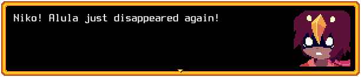

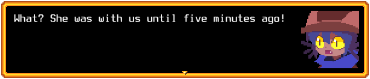

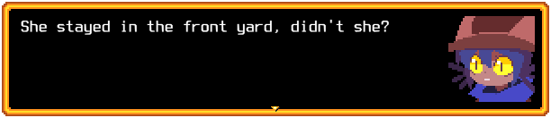

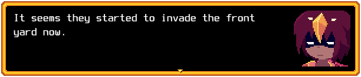

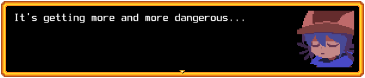

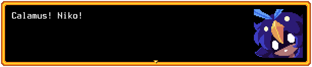

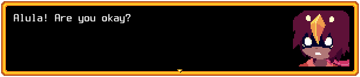

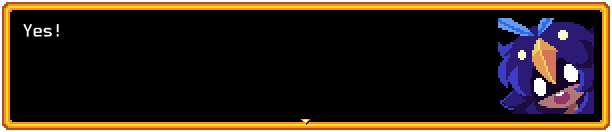

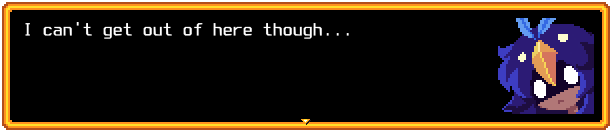

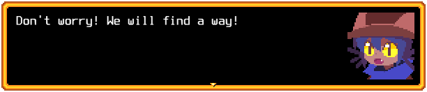

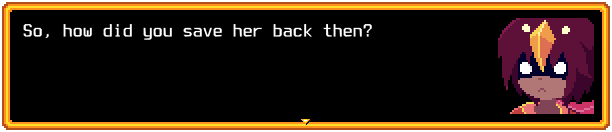

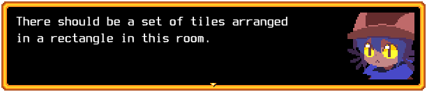

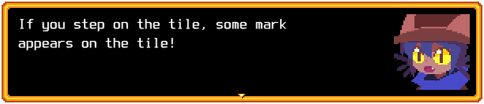

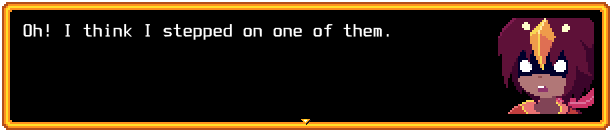

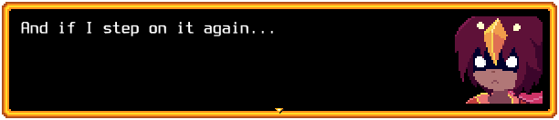

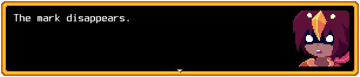

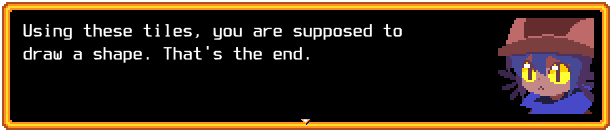

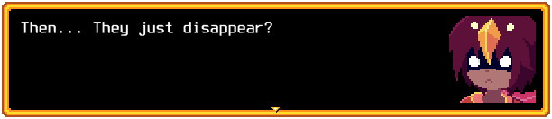

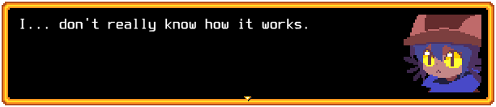

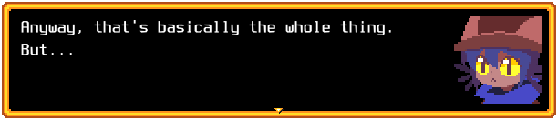

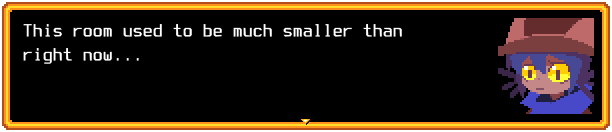

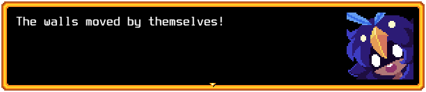

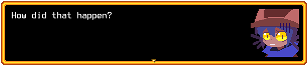

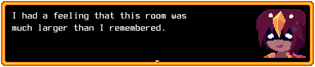

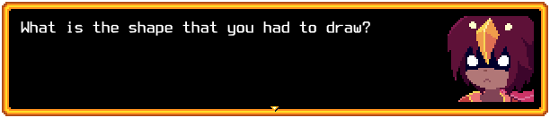

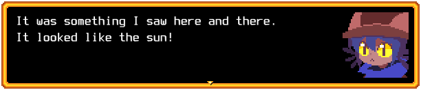

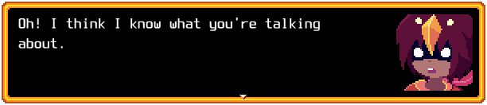

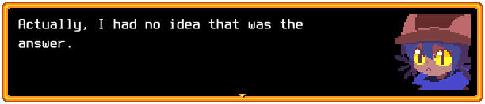

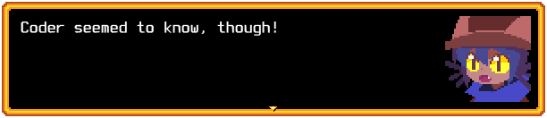

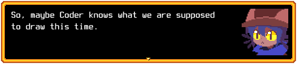

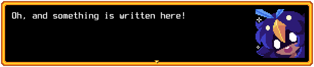

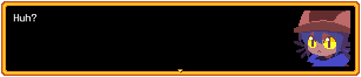

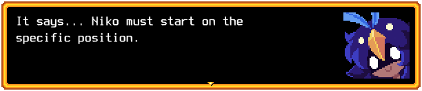

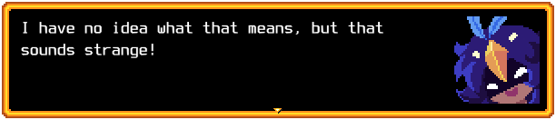

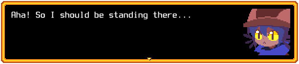

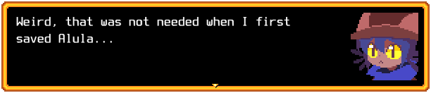

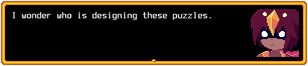

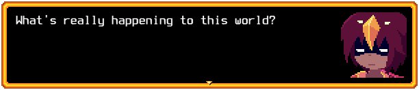

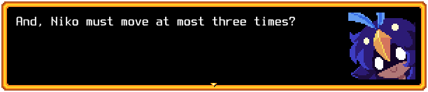

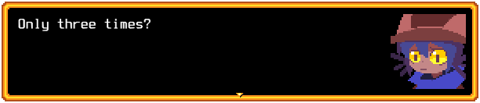

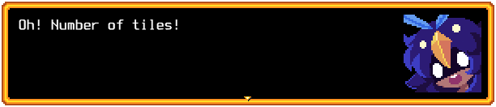

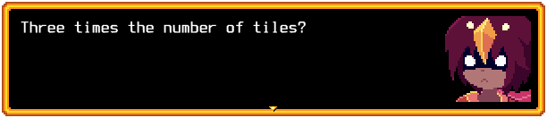

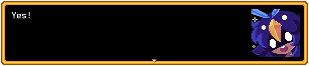

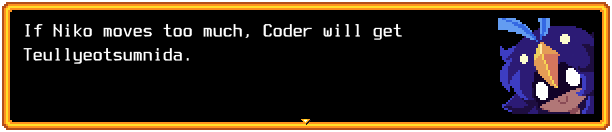

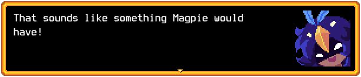

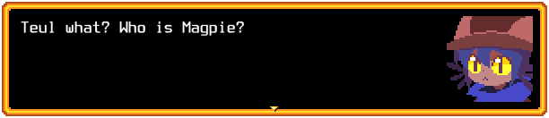

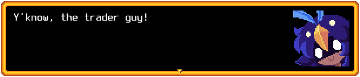

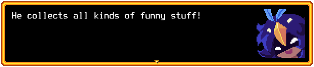

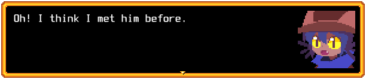

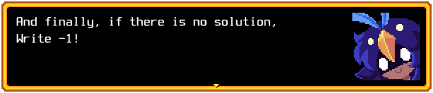

## 입력

On the first line, I will give two positive integers N and M.

N is the number of rows, and M is the number of columns.

Both integers are at most 100.

Each of the next N lines will describe each row of the tiles.

The tiles form a rectangle, remember?

Also, note that I will remove all marks on the tiles before Niko starts moving.

"#" means the mark is on that tile, and "." means the mark is not on that tile.

I guarantee that at least one tile has a mark.

## 출력

Tell Niko exactly how they should move.

"U" for up, "D" for down, "L" for left, and "R" for right.

Niko is allowed to go out of the rectangle.
