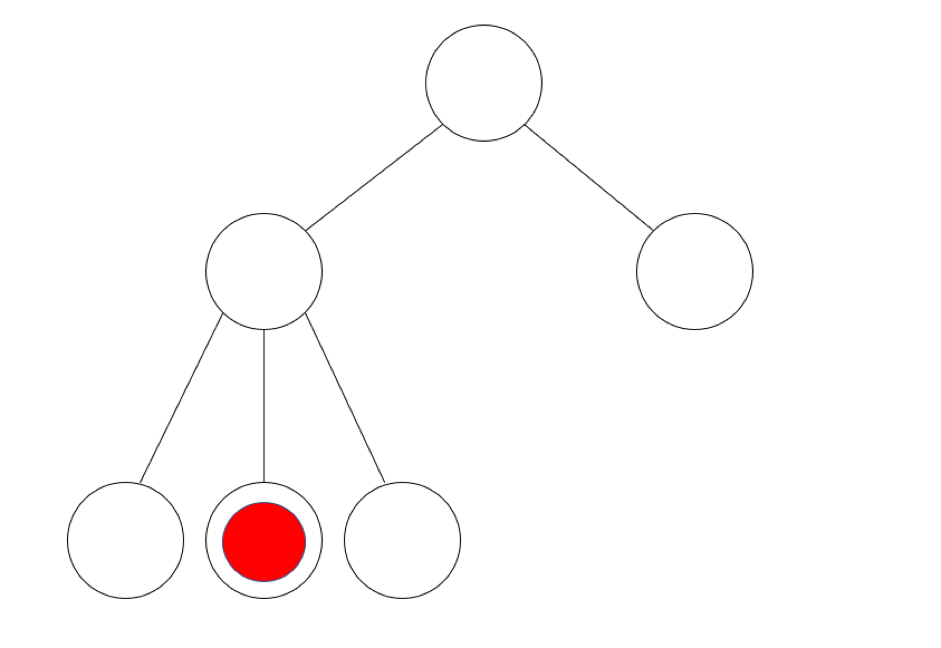

## 문제

트리란, 사이클이 없는 연결 그래프를 의미한다. 위 그림은 트리 모양의 입자가속기와 그 위의 어떤 정점에 놓인 특별한 입자 하나를 표시하고 있다. RB 입자라고 불리는 이 특이한 입자는 안정한 상태에서는 빨간색이지만, 불안정해질 경우 1초마다 색이 변하게 된다. 만일 빨간색이었다면 검은색이 되며, 검은색이었다면 빨간색으로 변하게 된다.

택희는 이 입자에 대한 간단한 실험을 해보려 한다. 우선 가속기 내에서 입자의 시작 정점과 끝 정점을 정해, 안정한 입자를 하나 꺼낸 뒤 불안정한 상태로 만들어 시작 지점에 놓는다. 이 과정에 걸리는 시간은 없다. 그 직후, 입자는 끝 정점을 향해 최단거리로 이동한다. 입자가 어떤 간선 하나를 통과하는 데에는 정확히 1초의 시간이 걸린다.

택희는 총 M번의 실험을 진행하였다. 하지만 실험에 몰두하던 택희는 실험 결과를 정리하는 것을 잊고 말았다. 택희가 각 실험에 대해 기억하는 정보는, 입자가 어떤 정점 U와 V를 잇는 간선을 U->V의 방향으로 통과한 적이 있다는 사실과 도착점에서의 입자의 색상 뿐이었다.

택희는 빠르게 실험보고서를 복원하려 한다. 그러기 위해, 우선 각 실험마다 가능한 (시작점, 도착점) 쌍의 수가 몇 개나 존재하는지를 알아보려 한다.

택희를 위해 실험보고서의 복원을 도와줘 보도록 하자.

## 입력

첫 줄에 입자가속기의 정점의 수 N (2 ≤ N ≤ 105)과 진행한 실험의 수 M(1 ≤ M ≤ 105) 이 주어진다.

이어 N-1줄에 걸쳐, 입자가속기에서 연결된 두 정점 U V가 주어진다. (1 ≤ U, V ≤ N, U ≠ V)

이어 M줄에 걸쳐, 실험에 대해 알고 있는 정보 U V C가 주어진다. (1 ≤ U, V ≤ N, C = 0 또는 1, U ≠ V)

이는 각 실험에서 입자가 U-V를 잇는 간선을 U->V의 방향으로 통과한 적이 있으며, 도착점에서의 색상은 C=0일 경우 빨간색, C=1일 경우 검은색이었음을 의미한다.

시작점에서의 입자는 항상 빨간색이며, 모든 실험에서 주어지는 U와 V에 대해 트리에는 반드시 U와 V를 잇는 간선이 존재함이 보장된다.

입력으로 주어지는 입자 가속기는 항상 올바른 트리 형태임이 보장된다.

## 출력

출력은 총 M줄로 이루어진다.

i번째 줄에는 i번째 실험에서 가능했던 서로 다른 (시작점, 도착점) 페어의 수를 출력한다.

계산 과정에서 32bit 부호 있는 정수 범위를 넘어갈 수 있음에 주의한다.
