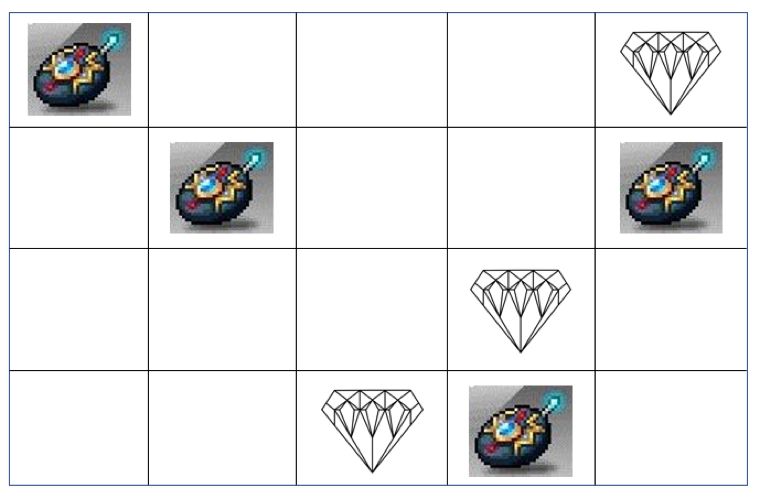

## 문제

*오늘 밤, 다녀가겠담.*

*-괴도 강산*

강산이의 예고장을 받은 박물관 관장 택희는 패닉 상태가 되었다. 강산이는 극악무도한 세계 최악의 괴도로, 그 예고장을 받은 곳에는 단 한 개의 보물도 남지 않는다. 하지만 택희는 포기할 수 없었다. 택희는 사비를 털어서 최신 위치추적 장비를 아주 많이 구매했고, 이를 통해 괴도 강산을 붙잡으려 한다.

택희의 박물관은 N행 M열 격자 그리드 모양으로, 박물관의 곳곳에는 보석이 놓여 있다. i행 j열에 해당하는 칸을 (i,j)라고 부르도록 하자. 택희는 보석이 없는 일부 칸에 위치추적기를 설치했다. 만일 강산이가 이 위치추적기를 가져간다면 강산이는 오랜 괴도 생활 끝에 결국 경찰에 붙잡히고 말 것이다.

하지만 강산이는 이미 택희가 박물관에 다수의 위치추적기를 설치했다는 정보를 알아내버렸고, 박물관에 있는 모든 보석을 성공적으로 훔치기 위해 아래와 같은 전략을 사용하려 한다.

* 행 또는 열 하나를 고른다. 고른 행(열) 전체를 왼쪽부터(위부터) 오른쪽까지(아래까지) 지나가면서 다음의 두 작업을 처리한다.
  + 보석 또는 위치추적기가 있는 칸을 지나간다면 해당 보석/위치추적기를 반드시 가져온다.
  + 위치추적기가 있었으나 현재는 비어 있는 칸을 방문하고 있으며, 현재 가지고 있는 위치추적기가 있다면 해당 위치에 반드시 한 개를 버린다.
* 만약 모든 보석을 손에 넣었고, 가지고 있는 위치추적기가 0개라면 박물관을 떠난다. 그렇지 않다면 다시 행 또는 열 하나를 고르고 위의 작업을 반복한다.

하지만 택희도 만만치 않았다. 강산이의 전략을 파악해버린 택희는, 위치추적기가 아닌 모든 보석들에 대해 해당 보석이 도난당할 경우 즉시 그 위치에 경비원이 출동할 수 있도록 준비해두었다. 이에 따라,

* 강산이는 어떤 (위치추적기가 아닌) 보석을 훔칠 경우, 다시는 그 칸을 포함한 행 또는 열에 들어가지 못한다.

아래의 예시를 보도록 하자.

위의 예제에서, 박물관은 4행 5열 그리드이며, 보석은 (1,5), (3,4), (4,3)에 놓여 있고, 위치추적기는 (1,1), (2,2), (2,5), (4,4)에 놓여있다. 위와 같은 상황에서, 강산이는 다음과 같은 방법으로 보석을 모두 훔칠 수 있다.

1. 4행에 놓인 (4,3) 보석과 (4,4) 위치추적기를 가져온다.
2. 4열에 놓인 (3,4) 보석을 가져오면서, (4,4)에 위치추적기를 다시 가져다놓는다.
3. 1행에 놓인 (1,1) 위치추적기와 (1,5) 보석을 가져온다.
4. 1열로 들어가서, (1,1)에 위치추적기를 다시 가져다놓는다. 이때, 강산이는 반드시 (1,1), (2,1), (3,1), (4,1)을 모두 방문해야만 한다. 즉, (1,1)만을 방문한 뒤 바로 나가는 것은 불가능하다.

이때, (2,2), (2,5)의 위치추적기는 애초에 건드리지 않았으므로 문제가 되지 않고, (1,1) 위치추적기를 다시 가져다 놓는 과정(위의 4번 과정)에서 1열이 아닌 1행으로 들어가는 것은 (1,5)의 위치의 보석을 훔친 뒤 (1,5)에 경비원이 서 있게 되기 때문에 불가능하다.

강산이에게는 타협이 없기 때문에, 반드시 박물관에 놓인 모든 보석을 한 개도 빠짐없이 가져오면서 위치추적기에 의한 경찰의 추적까지 피하고 싶다.

강산이가 오늘도 성공적으로 괴도 강산의 이름을 날릴 수 있을지 알아보도록 하자.

## 입력

첫째 줄에 박물관의 행의 수 N, 열의 수 M이 주어진다. (1 ≤ N, M ≤ 103)

이어 N줄에 걸쳐 M개의 문자로 박물관의 각 행의 모습이 주어진다. 각 문자는 항상 ‘`.`’ , ‘`*`’, ‘`#`’ 중 하나이며, ‘`.`’은 아무것도 놓여 있지 않은 빈 칸을, ‘`*`’은 보석의 위치를, ‘`#`’은 위치추적기의 위치를 의미한다.

박물관에는 보석이 적어도 하나 이상 있음이 보장된다.

## 출력

만약 강산이가 목적을 달성할 수 있다면 첫째 줄에 1을, 그렇지 않다면 0을 출력한다.
