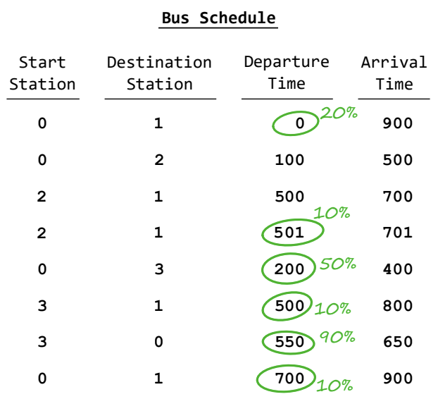

## 문제

Your plane to the ICPC Finals departs in a short time, and the only way to get to the airport is by bus. Unfortunately, some of the bus drivers are considering going on strike, so you do not know whether you can get to the airport on time. Your goal is to plan your journey in such a way as to maximize the probability of catching your plane.

You have a detailed map of the city, which includes all the bus stations. You are at station 0 and the airport is at station 1. You also have a complete schedule of when each bus leaves its start station and arrives at its destination station. Additionally, for each bus you know the probability that it is actually going to run as scheduled, as opposed to its driver going on strike and taking the bus out of service. Assume all these events are independent. That is, the probability of a given bus running as planned does not change if you know whether any of the other buses run as planned.

If you arrive before the departure time of a bus, you can transfer to that bus. But if you arrive exactly at the departure time, you will not have enough time to get on the bus. You cannot verify ahead of time whether a given bus will run as planned – you will find out only when you try to get on the bus. So if two or more buses leave a station at the same time, you can try to get on only one of them.

Figure A.1: Bus schedule corresponding to Sample Input 1.

Consider the bus schedule shown in Figure A.1. It lists the start and destination stations of several bus routes along with the departure and arrival times. You have written next to some of these the probability that that route will run. Bus routes with no probability written next to them have a 100% chance of running. You can try catching the first listed bus. If it runs, it will take you straight to the airport, and you can stop worrying. If it does not, things get more tricky. You could get on the second listed bus to station 2. It is certain to leave, but you would be too late to catch the third listed bus which otherwise would have delivered you to the airport on time. The fourth listed bus – which you can catch – has only a 0.1 probability of actually running. That is a bad bet, so it is better to stay at station 0 and wait for the fifth listed bus. If you catch it, you can try to get onto the sixth listed bus to the airport; if that does not run, you still have the chance of returning to station 0 and catching the last listed bus straight to the airport.

## 입력

The first line of input contains two integers m (1 ≤ m ≤ 106) and n (2 ≤ n ≤ 106), denoting the number of buses and the number of stations in the city. The next line contains one integer k (1 ≤ k ≤ 1018), denoting the time by which you must arrive at the airport.

Each of the next m lines describes one bus. Each line contains integers a and b (0 ≤ a, b < n, a ≠ b), denoting the start and destination stations for the bus. Next are integers s and t (0 ≤ s < t ≤ k), giving the departure time from station a and the arrival time at station b. The last value on the line is p (0 ≤ p ≤ 1, with at most 10 digits after the decimal point), which denotes the probability that the bus will run as planned.

## 출력

Display the probability that you will catch your plane, assuming you follow an optimal course of action. Your answer must be correct to within an absolute error of 10−6.
