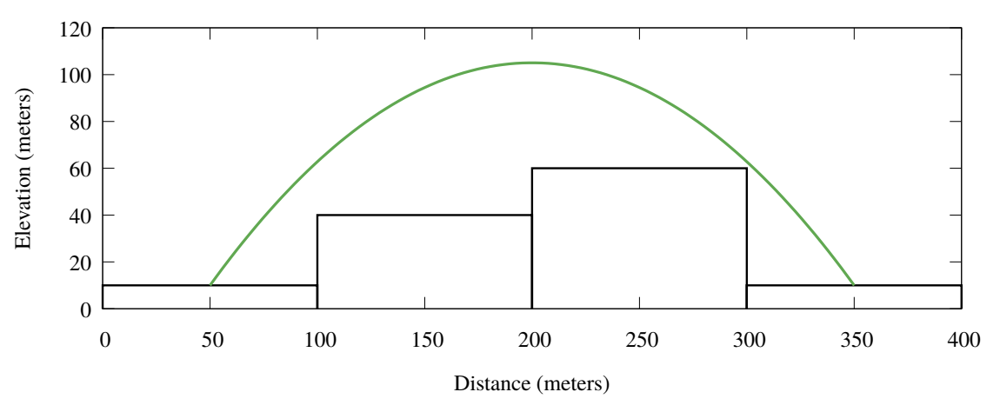

## 문제

Your friend Robin is a superhero. When you first found out about this, you figured “everybody needs a hobby, and this seems more exciting than stamp collecting,” but now you are really thankful that somebody is doing something about the crime in your hometown.

Every night, Robin patrols the city by jumping from roof to roof and watching what goes on below. Naturally, superheroes need to respond to crises immediately, so Robin asked you for help in figuring out how to get around your hometown quickly.

Your hometown is built on a square grid, where each block is w × w meters. Each block is filled by a single building. The buildings may have different heights (see Figure E.1). To get from one building to another (not necessarily adjacent) building, Robin makes a single jump from the center of the roof of the first building to the center of the roof of the second building. Robin cannot change direction while in the air, but can choose the angle at which to lift off.

Figure E.1: Cross-section of buildings corresponding to the first sample input. Buildings are shown in black, and the jump from the roof at (1, 1) to the roof at (4, 1) is shown with a green line.

Of course, Robin only wants to perform jumps without colliding with any buildings. Such collisions do little damage to a superhero, but building owners tend to get irritated when someone crashes through their windows. You explain the physics to Robin: “All your jumps are done with the same initial velocity v, which has a horizontal component vd towards the destination and vertical component vh upwards, so vd2 + vh2 = v2 . As you travel, your horizontal velocity stays constant (vd(t) = vd), but your vertical velocity is affected by gravity (vh(t) = vh − t · g), where g = 9.80665 m/s2 in your hometown. Naturally, your cape allows you to ignore the effects of air resistance. This allows you to determine your flight path and ...” at which point you notice that Robin has nodded off – less math, more super-heroing!

So it falls to you: given a layout of the city and the location of Robin’s secret hideout, you need to determine which building roofs Robin can reach, and the minimum number of jumps it takes to get to each roof.

Note that if Robin’s jump passes over the corner of a building (where four buildings meet), then the jump needs to be higher than all four adjacent buildings.

## 입력

The input starts with a line containing six integers dx, dy, w, v, ℓx, ℓy. These represent the size dx × dy of the city grid (1 ≤ dx, dy ≤ 20) in blocks, the width of each building (1 ≤ w ≤ 103) in meters, Robin’s takeoff velocity (1 ≤ v ≤ 103) in meters per second, and the coordinates (ℓx, ℓy) of Robin’s secret hideout (1 ≤ ℓx ≤ dx, 1 ≤ ℓy ≤ dy).

The first line is followed by a description of the heights of the buildings in the city grid. The description consists of dy lines, each containing dx non-negative integers. The jth line contains the heights for buildings (1, j),(2, j), . . . ,(dx, j). All heights are given in meters and are at most 103.

## 출력

Display the minimum number of jumps Robin needs to get from the secret hideout to the roof of each building. If there is no way to reach a building’s roof, display X instead of the number of jumps. Display the buildings in the same order as given in the input file, split into dy lines, each containing dx values.

You may assume that changing the height of any building by up to 10−6 would not change the answers.
