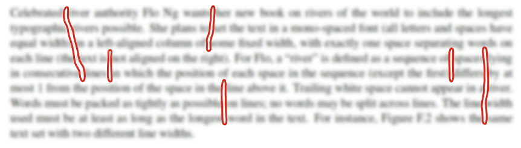
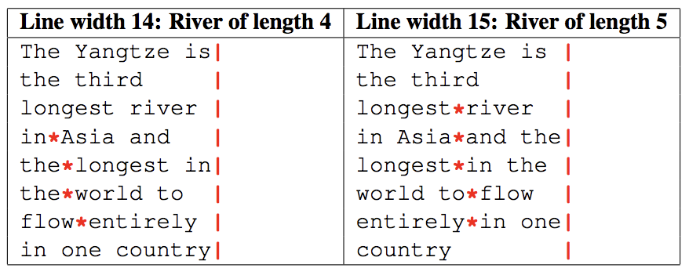

## 문제

In typesetting, a “river” is a string of spaces formed by gaps between words that extends down several lines of text. For instance, Figure F.1 shows several examples of rivers highlighted in red (text is intentionally blurred to make the rivers more visible).

Figure F.1: Examples of rivers in typeset text.

Celebrated river authority Flo Ng wants her new book on rivers of the world to include the longest typographic rivers possible. She plans to set the text in a mono-spaced font (all letters and spaces have equal width) in a left-aligned column of some fixed width, with exactly one space separating words on each line (the text is not aligned on the right). For Flo, a “river” is defined as a sequence of spaces lying in consecutive lines in which the position of each space in the sequence (except the first) differs by at most 1 from the position of the space in the line above it. Trailing white space cannot appear in a river. Words must be packed as tightly as possible on lines; no words may be split across lines. The line width used must be at least as long as the longest word in the text. For instance, Figure F.2 shows the same text set with two different line widths.

Figure F.2: Longest rivers (`*`) for two different line widths.

Given a text, you have been tasked with determining the line width that produces the longest river of spaces for that text.

## 입력

The first line of input contains an integer n (2 ≤ n ≤ 2 500) specifying the number of words in the text. The following lines of input contain the words of text. Each word consists only of lowercase and uppercase letters, and words on the same line are separated by a single space. No word exceeds 80 characters.

## 출력

Display the line width for which the input text contains the longest possible river, followed by the length of the longest river. If more than one line width yields this maximum, display the shortest such line width.
