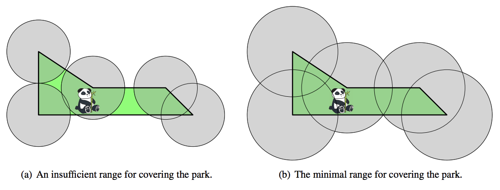

## 문제

Last month, Sichuan province secured funding to establish the Great Panda National Park, a natural preserve for a population of more than 1 800 giant pandas. The park will be surrounded by a polygonal fence. In order for researchers to track the pandas, wireless receivers will be placed at each vertex of the enclosing polygon and each animal will be outfitted with a wireless transmitter. Each wireless receiver will cover a circular area centered at the location of the receiver, and all receivers will have the same range. Naturally, receivers with smaller range are cheaper, so your goal is to determine the smallest possible range that suffices to cover the entire park.

As an example, Figure G.1 shows the park described by the first sample input. Notice that a wireless range of 35 does not suffice (a), while the optimal range of 50 covers the entire park (b).

Figure G.1: Illustration of Sample Input 1.

## 입력

The first line of the input contains an integer n (3 ≤ n ≤ 2 000) specifying the number of vertices of the polygon bounding the park. This is followed by n lines, each containing two integers x and y (|x|, |y| ≤ 104) that give the coordinates (x, y) of the vertices of the polygon in counter-clockwise order. The polygon is simple; that is, its vertices are distinct and no two edges of the polygon intersect or touch, except that consecutive edges touch at their common vertex.

## 출력

Display the minimum wireless range that suffices to cover the park, with an absolute or relative error of at most 10−6.
