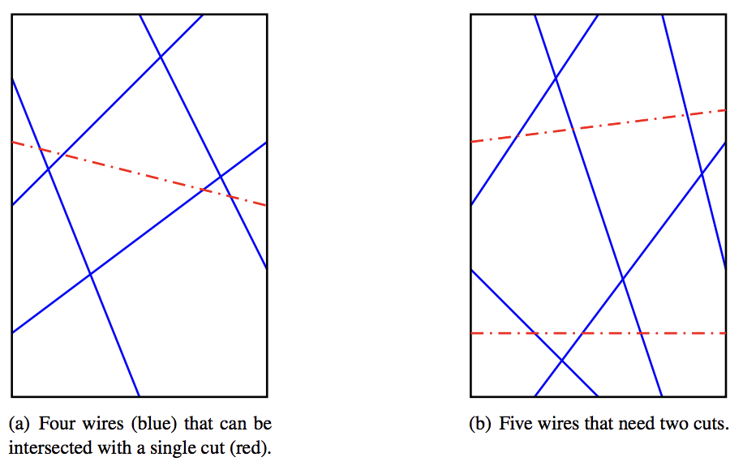

## 문제

The Intrusion and Crime Prevention Company (ICPC) builds intrusion detection systems for homes and businesses. The International Collegiate Programming Contest (in a strange coincidence also known as ICPC) is considering hiring the company to secure the room that contains the problem set for next year’s World Finals.

The contest staff wants to prevent the intrusion attempts that were made in past years, such as rappelling down the outside of the building to enter through a window, crawling through air ducts, impersonating Bill Poucher, and the creative use of an attack submarine. For that reason, the problems will be stored in a room that has a single door and no other exits.

ICPC (the company) proposes to install sensors on the four sides of the door, where pairs of sensors are connected by wires. If somebody opens the door, any connected sensor pair will detect this and cause an alarm to sound.

The system has one design flaw, however. An intruder might cut the wires before opening the door. To assess the security of the system, you need to determine the minimum number of line segments that cut all wires. Figure H.1 shows two configurations of wires on the door (corresponding to the two sample inputs), and minimum-size cuts that intersect all wires.

Figure H.1: Illustrations of Sample Inputs 1 and 2.

## 입력

The input starts with a line containing three integers n, w, and h, which represent the number of wires installed (1 ≤ n ≤ 106) and the dimensions of the door (1 ≤ w, h ≤ 108). This is followed by n lines, each describing a wire placement. Each of these lines contains four integers x1, y1, x2, and y2 (0 ≤ x1, x2 ≤ w, 0 ≤ y1, y2 ≤ h), meaning that a wire goes from (x1, y1) to (x2, y2). Each wire connects different sides of the door. No wire is anchored to any of the four corners of the door. All locations in the input are distinct.

## 출력

Display a minimum-size set of straight line cuts that intersect all wires. First, display the number of cuts needed. Then display the cuts, one per line in the format x1 y1 x2 y2 for the cut between (x1, y1) and (x2, y2). Each cut has to start and end on different sides of the door. Cuts cannot start or end closer than 10−6 to any wire anchor location or any corner of the door.

Cuts may be displayed in any order. The start and end locations of each cut may be displayed in either order. If there are multiple sets of cuts with the same minimum size, display any of them.
