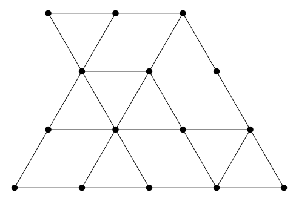

## 문제

For your trip to Beijing, you have brought plenty of puzzle books, many of them containing challenges like the following: how many triangles can be found in Figure I.1?

Figure I.1: Illustration of Sample Input 2.

While these puzzles keep your interest for a while, you quickly get bored with them and instead start thinking about how you might solve them algorithmically. Who knows, maybe a problem like that will actually be used in this year’s contest. Well, guess what? Today is your lucky day!

## 입력

The first line of input contains two integers r and c (1 ≤ r ≤ 3 000, 1 ≤ c ≤ 6 000), specifying the picture size, where r is the number of rows of vertices and c is the number of columns. Following this are 2r − 1 lines, each of them having at most 2c − 1 characters. Odd lines contain grid vertices (represented as lowercase x characters) and zero or more horizontal edges, while even lines contain zero or more diagonal edges. Specifically, picture lines with numbers 4k + 1 have vertices in positions 1, 5, 9, 13, . . . while lines with numbers 4k + 3 have vertices in positions 3, 7, 11, 15, . . . . All possible vertices are represented in the input (for example, see how Figure I.1 is represented in Sample Input 2). Horizontal edges connecting neighboring vertices are represented by three dashes. Diagonal edges are represented by a single forward slash (‘`/`’) or backslash (‘`\`’) character. The edge characters will be placed exactly between the corresponding vertices. All other characters will be space characters. Note that if any input line could contain trailing whitespace, that whitespace may be omitted.

## 출력

Display the number of triangles (of any size) formed by grid edges in the input picture.
