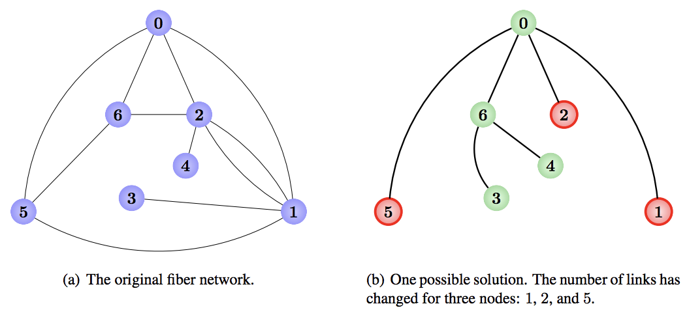

## 문제

A new type of unbounded-bandwidth wireless communication has just been tested and proved to be a suitable replacement for the existing, fiber-based communications network, which is struggling to keep up with traffic growth. You have been charged with deciding the layout of the new communications network. The current communications network consists of a set of nodes (which route messages), and links of fiber, each of which connects two different nodes. For each pair of nodes, there exists at least one way (but possibly more, for bandwidth purposes) to travel along the fiber between the two.

The new communications network will not have any fiber. Instead, it will have wireless links, each connecting two nodes. These links have unbounded bandwidth but are expensive, so it has been decided that as few of these links will be built as possible to provide connectivity; for each pair of nodes there should be exactly one way to travel between them along the wireless links. Moreover, you discovered that the nodes have each been built with a particular number of connections in mind. For each node, if it will be connected to a different number of links than it is today, it will have to be reorganized, and that is costly.

Your task is to design the new network so that it has precisely one path between each pair of nodes while minimizing the number of nodes that do not have the same number of connections as in the original network. Figure K.1 shows the original network and a solution for Sample Input 1.

Figure K.1: Illustration of Sample Input 1.

## 입력

The input begins with a line containing two integers n (2 ≤ n ≤ 104) and m (1 ≤ m ≤ 105), denoting the number of nodes and the number of fiber links in the existing network. The nodes are numbered from 0 to n − 1. Each of the next m lines contains two distinct integers ai and bi, denoting the fact that the ith fiber link connects nodes numbered ai and bi. It is guaranteed that for each pair of nodes there exists at least one path connecting the two nodes. Any pair of nodes may have more than one fiber link connecting them.

## 출력

Display the smallest number of nodes for which the number of connected links needs to change. Starting on the next line, display a system of connections in the same format as the input. That is, display a line containing the number of nodes (this will be the same as in the input) and the number of wireless links, and then on subsequent lines descriptions of the links. If more than one layout is possible, any valid layout will be accepted.
