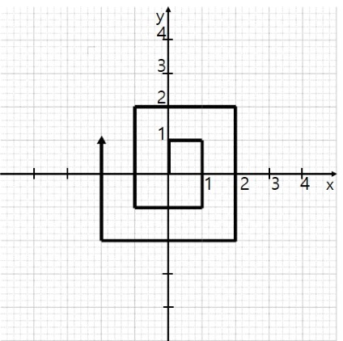

## 문제

달팽이는 원점에서 시작하여 1초에 한 칸 씩, 시계방향으로 아래 그림과 같이 움직인다. (단, 1초일 때 달팽이의 위치는 (0, 1)이다.) 몇 초가 지났는지가 입력으로 주어질 때, 현재 달팽이의 위치를 좌표로 출력하시오.

## 입력

달팽이가 움직인 시간이 n초로 주어진다. (0 ≤ n ≤ 1000, n은 0이상의 정수)

## 출력

현재 달팽이의 위치를 x, y좌표 순서로 출력한다.

## 힌트

* 방향에 따라 x와y좌표의 증감의 규칙이 있다.
* 달팽이의 자취에서 한 변을 1회로 보자. 이때 변의 길이는 2회 동안 유지되며 변의 길이가 변할 때는 1씩 규칙적으로 증가한다.
