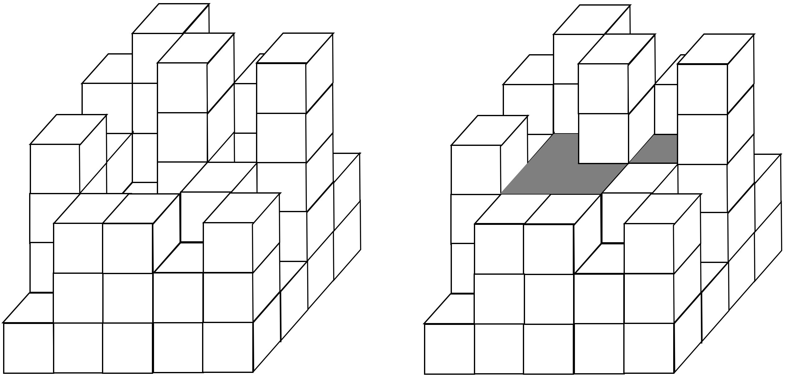

## 문제

수영장 사업을 시작하려는 수형이는 산의 자연을 훼손하지 않고 지형을 그대로 이용한 수영장을 만들기로 한다. 그래서 물이 고일 수 있는 부분에만 물을 채워넣는 방법을 사용하기로 한다. 이때 수형이는 여기서 얼마만큼의 물을 채울 수 있는지 궁금해 하는데, 땅의 정보가 주어졌을 때 얼마만큼의 물을 채울 수 있는지 출력하는 프로그램을 작성하시오.

## 입력

첫째 줄에 N, M(1 ≤ N, M ≤ 100)가 주어진다. 다음 N 줄동안 매 줄마다 M개의 H(0 ≤ H ≤ 10,000)가 주어진다. 여기서 i 번째 줄의 j 번째 정수를 H[i][j] 라고 할 때, H[i][j]는 해당하는 땅의 높이이다.

## 출력

최대한 물을 채웠을 때 얼마만큼의 물을 채울 수 있는지를 출력한다.

## 힌트

다음과 같이 총 5 만큼의 물을 채울 수 있다.

