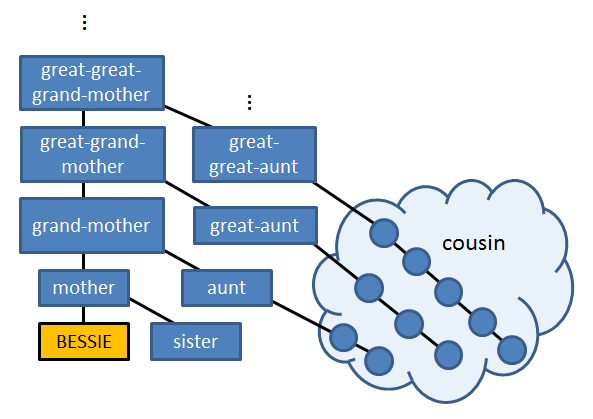

## 문제

Farmer John owns a family-run farm that has been passed down over several generations, with a herd of cows whose familial roots can similarly be traced back several generations on the same farm. By examining old records, Farmer John is curious how the cows in his current herd are related to each-other. Please help him in this endeavor!

## 입력

The first line of input contains $N$ ($1 \leq N \leq 100$) followed by the names of two cows. Cow names are each strings of at most 10 uppercase letters ($A \ldots Z$). Farmer John is curious about the relationship between the two cows on this line of input.

The next $N$ lines each contain two cow names $X$ and $Y$, indicating that $X$ is the mother of $Y$.

## 출력

You should print one line of output indicating the relationship between the two cows specified on the first line of input (for simplicity, let's call these two cows BESSIE and ELSIE for the examples below). Here are the different types of relationships that are possible:

* You should output "SIBLINGS" if BESSIE and ELSIE have the same mother.
* BESSIE might be a direct descendant of ELSIE, meaning that ELSIE is either the mother, grand-mother, great-grand-mother, great-great-grand-mother, etc., of BESSIE. If this is the case, you should print "ELSIE is the (relation) of BESSIE", where (relation) is the appropriate relationship, for example "great-great-grand-mother".
* If ELSIE is a child of an ancestor of BESSIE (and ELSIE is not herself an ancestor or sister of BESSIE), then ELSIE is BESSIE's aunt. You should output "ELSIE is the aunt of BESSIE" if ELSIE is a child of BESSIE's grand-mother, "ELSIE is the great-aunt of BESSIE" if ELSIE is a child of BESSIE's great-grand-mother, "ELSIE is the great-great-aunt of BESSIE" if ELSIE is a child of BESSIE's great-great-grand-mother, and so on.
* If BESSIE and ELSIE are related by any other means (i.e., if they share a common ancestor), they are cousins, and you should simply output "COUSINS".
* You should output "NOT RELATED" if BESSIE and ELSIE have no common ancestor, or neither is directly descended from the other.

The following diagram helps illustrate the relationships above, which are the only relationship types you need to consider. Observe that some relationships like "niece" (daughter of sister) are not necessary since if BESSIE is the niece of ELSIE, then ELSIE is BESSIE's aunt.

