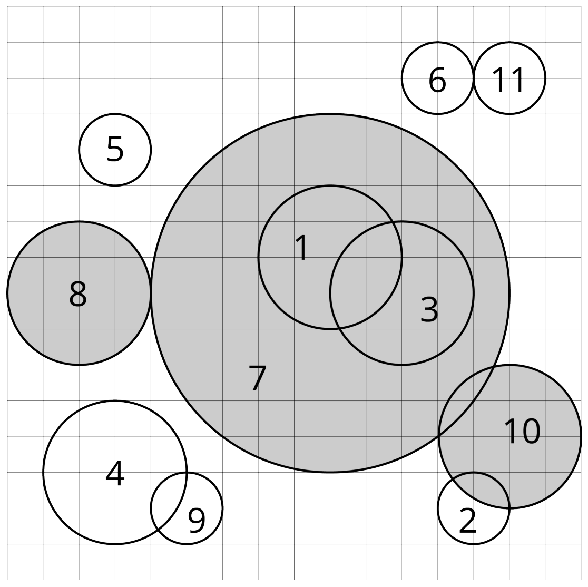

## 문제

Given *n* circles *c1*, *c2*, . . . , *cn* on a flat Cartesian plane. We attempt to do the following:

1. Find the circle *ci* with the largest radius. If there are multiple candidates all having the same (largest) radius, choose the one with the smallest index. (i.e. minimize *i*).
2. Remove *ci* and all the circles intersecting with *ci*. Two circles intersect if there exists a point included by both circles. A point is included by a circle if it is located in the circle or on the border of the circle.
3. Repeat 1 and 2 until there is no circle left.

We say *ci* is eliminated by *cj* if *cj* is the chosen circle in the iteration where *ci* is removed. For each circle, find out the circle by which it is eliminated.

## 입력

The first line contains an integer *n*, denoting the number of circles (1 ≤ *n* ≤ 3 · 105). Each of the next *n* lines contains three integers *xi*, *yi*, *ri*, representing the x-coordinate, the y-coordinate, and the radius of the circle *ci* (−109 ≤ *xi*, *yi* ≤ 109, 1 ≤ *ri* ≤ 109).

## 출력

Output *n* integers *a1*, *a2*, . . . , *an* in the first line, where *ai* means that *ci* is eliminated by *cai*.

## 힌트

The picture in the statements illustrates the first example.
