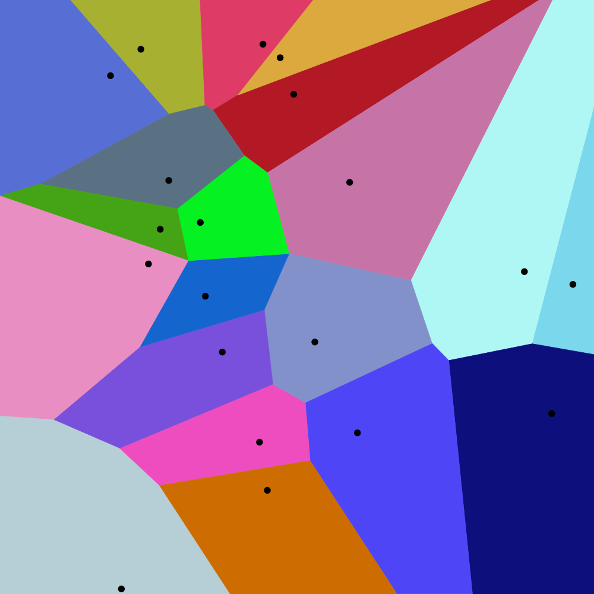
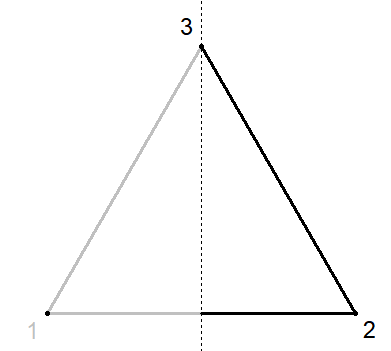
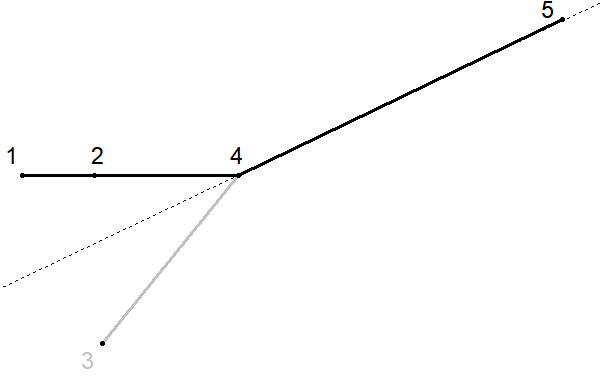
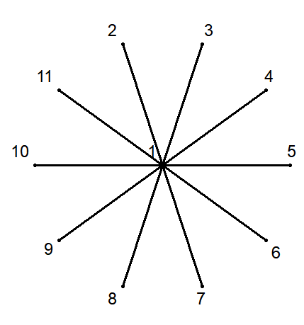

## 문제

사진: 유클리드 좌표계에서 20개의 점으로 만든 Voronoi Diagram. 출처: Wikipedia

평면 위에 있는 크기 *n*의 점 집합을 생각하자. 이 점 집합의 **Voronoi Diagram**은, 평면 상의 점을 "어떤 점과 가장 가까운가?" 에 대한 기준으로 분할한 그림을 뜻한다. 예를 들어, 위 사진에서 평면 상의 모든 위치는, 그 위치와 가장 가까운 검은 점에 따라서 색이 칠해져 있다. Voronoi Diagram은 O(*n* log(*n*))에 계산하는 알고리즘이 알려져 있지만, 매우 어렵고 복잡한 알고리즘으로 악명이 높다.

모 대회에서 Voronoi Diagram에 대한 문제를 풀지 못한 민규는, 그 충격으로 인해서 매일 매일을 술과 함께 보내고 있었다. 어느 날 오후, 민규는 여느 때와 같이 낮술을 하고 있다가, 매우 천재적인 Voronoi Diagram 알고리즘을 발견하였다! 민규는 이에 관한 논문을 쓰기 전에 2018 KAIST RUN Spring Contest 에 관련된 문제를 출제하여서 만점자의 출현을 막으려 한다.

민규의 Voronoi Diagram 알고리즘은 왜 천재적일까? 보통 Voronoi Diagram은 평면에서만 적용되는데, 민규의 Voronoi Diagram은 더 일반화된 구조인 그래프에서 적용되기 때문이다. 정점이 *N*개이고, 양의 가중치가 있는 간선이 *M*개 있는 연결 그래프를 생각하자. 이 그래프에서 크기 *K*의 정점 집합이 주어졌을 때, 이 점 집합의 "Voronoi Diagram" 은 이 그래프의 모든 간선 상의 위치에 대해서, "정점 집합에 있는 어떤 점과 가장 가까운가" 에 대한 기준으로 분할한 그림을 뜻한다. 만약 같은 거리의 점이 여러 개 있으면, 이들 중 가장 정점의 번호가 작은 정점을 기준으로 한다.

가중치 있는 그래프가 주어졌을 때, 당신은 각각의 점에 대해서, "Voronoi Diagram"에서 해당 점과 가장 가깝게 표현된 간선의 길이를 모두 더한 값을 출력해야 한다. 이 문제를 풀고, 민규보다 먼저 논문을 써서 민규의 코를 납작하게 해주자!

## 입력

첫 번째 줄에 정점의 개수 *N*, 간선의 개수 *M*이 공백으로 구분되어 주어진다.

이후 *M*개의 줄의 *i*번째 줄엔 간선이 잇는 두 정점의 번호 *si*, *ei*와, 간선의 가중치 *wi*가 세 개의 정수로 공백으로 구분되어 주어진다.

다음 줄에 정점 집합의 크기 *K*가 주어진다.

다음 줄에 *K*개의 서로 다른 정수 *ai*가 오름차순으로 공백으로 구분되어 주어진다. 정점 집합을 이루고 있는 정점들의 번호를 뜻한다.

입력으로 주어진 그래프는 연결그래프 임이 보장된다. 즉, 임의의 정점에서 임의의 정점으로 가는 경로가 존재한다.

## 출력

*K*개의 줄에 걸쳐서 하나의 실수를 출력한다. *i*번째 줄에는, *ai* 번 정점을 가장 가까운 정점으로 가지는 길이의 합을 출력하라.

모든 출력은 소수점 둘째 자리에서 반올림하여서 출력하여야 한다. 실수 오차 관리에 초점을 맞춘 최근 ACM-ICPC World Finals의 경향에 맞춰서, 출력 시 **일체의 오차도 허용되지 않는다**.

## 힌트

예제에 대한 그림은 다음과 같다.:

