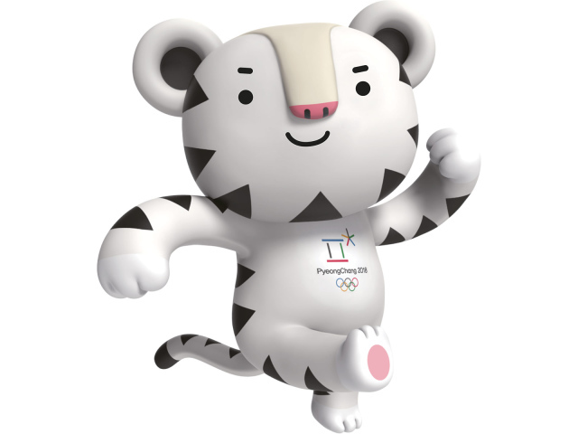

## 문제

사진: 문제와 아무 관련이 없지만, 아무튼 귀여운 수호랑.

2018 RUN@KAIST 겨울 컬링 대회의 마지막 여자 결승전이 열리는 지금, 꽁꽁 얼어붙은 오리연못에서 한국의 여자 컬링 팀은 즈웨펜(Jwepan)과 숨막히는 경쟁을 펼치는 중이다!

지금 오리연못 위에는 *N*개의 돌 (컬링스톤)이 놓여 있다. 두 팀의 엄청난 경쟁을 보여주듯이, 모든 돌은 과녁에서부터 일렬로 순서대로 놓여 있다. 즉, 가장 왼쪽에 있는 돌이 과녁에서 가장 가까우며, 가장 오른쪽에 있는 돌이 과녁에서 가장 멀다. 돌은 한국 대표단의 돌이거나 ('`1`') 즈웨펜 대표단의 돌 ('`0`') 이며, 이러한 돌들의 배치는 길이 *N*의 이진 문자열로 나타낼 수 있다.

한국 대표팀은 평창 올림픽 이후 엄청난 연습을 통해서, 이제 몇 번의 샤우팅(?) 만 해 주면, 컬링스톤을 나르는 영미가 연속해서 놓여있는 몇 개의 돌들을 전부 쳐내고, 그 자리에 자기 팀의 돌을 넣는 플레이를 할 수 있게 되었다. 즉, 한국 팀은 이진 문자열의 어떠한 구간을 골라 (구간이 문자열 전체이거나 비어있을 수 있다.) 이 구간을 "`1`" 으로 대체할 수 있는 능력을 가진 것이다.

오랜 연습으로 컬링 전략에 통달한 한국 팀은, 정확히 한 번의 연산을 통해서 주어진 문자열을 **사전 순 최대** 로 만드는 것이 게임을 하는 최선의 전략이라는 것을 깨달았다! 한국 대표단은 대회 상황에서  빠른 의사결정을 하기 위해서, 이 문제를 해결하는 가장 빠른 알고리즘을 찾고 싶어한다. 한국 대표단을 도와주자!

단, 길이 *n*의 문자열 *s* = *s*1*s*2...*sn*이 길이 *m*의 문자열 *t* = *t*1*t*2...*tm* 보다 **사전순으로 크다**는 것은, 다음 둘 중 하나를 만족한다는 것을 의미한다.

* 어떤 *i*에 대해서, *s*1 = *t*1, *s*2 = t\_2, ..., *s**i*-1 = *t**i*-1 이고, *si* > *ti* 이다.
* *n* > *m*이고, *s*1 = *t*1, *s*2 = *t*2, ..., *sm* = *tm* 이다.

## 입력

첫 번째 줄에 돌의 개수 *N*이 주어진다.

두 번째 줄에 길이 *N*의 '`0`' 혹은 '`1`'로 이루어진 이진 수열이 주어진다. 과녁에서 가까운 쪽에서 멀어지는 순서로, 각각의 돌이 어떤 팀의 소유인지를 나타낸다. '`0`' 혹은 '`1`' 사이에 공백이나 따옴표는 주어지지 않는다.

## 출력

두 개의 정수 *S*, *L*을 공백으로 구분하여 출력한다. 이는 영미가 *S*번째 문자 직후의 *L*개의 돌을 제거했음을 뜻한다. 만약 가능한 경우가 여럿 있으면, 이 중 아무 거나 출력해도 된다. (0 ≤ *S*, *L* ≤ *N*)
