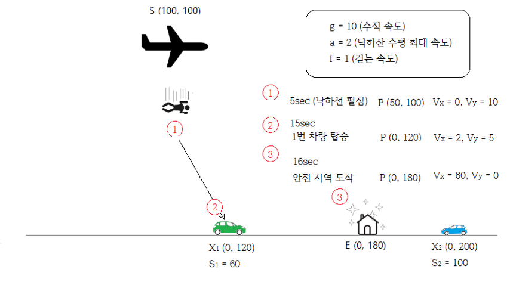

## 문제

규환이는 최근에 배틀그라운드에 흠뻑 빠졌다. 배틀그라운드는 100명의 사람과 생존 경쟁을 하는 2차원 게임이다. 배틀그라운드 맵의 크기는 (0,0) ~ (Ys, N)이며, 마지막까지 살아남기 위해선 안전한 지역을 확보하는 것이 중요하다.  게임 시작시 시작 지점 S(Ys, Xs)에서 일정한 속도 g로 수직 낙하하게 되며, 수직 낙하 도중에는 왼쪽이나 오른쪽으로 이동할 수 없고, 원하는 순간에 낙하산을 펼 수 있다.

이때, 규환이의 목표는 안전 지역 E(0, Xe)로 최대한 빠르게 이동하는 것인데 안전 지역으로 이동하는 방법은 1) 낙하산을 펴고 바로 가는 방법, 2) 걸어가는 방법, 3) 차를 타고 가는 방법이 있다. 낙하산을 펴게 되면 왼쪽이나 오른쪽으로 최대 a의 수평 속도로 이동할 수  있고, (즉, 수평 속력은 0~a 가속하는데 걸리는 시간은 0이라고 가정한다) 낙하 속도는 g/2로 감소하게 된다. 낙하산 착륙 위치의 x좌표 값은 항상 0이상의 정수 값이어야 한다

낙하산을 타고 착륙했을 시(y값이 0이 되었을 때) 착륙 후에 걸어가거나 차를 탈 수 있으며 걸어가는 속도는 f이고, 차는 M개가 존재한다. M개의 차는 차마다 위치 P(0,Xp)와 차의 속도 Sp를 갖는다.(차가 가속하는데 걸리는  시간은 0이라고 가정하고, 차를 갈아타는 시간 역시 0이라고 가정하며, 차가 방향을 전환하는데 걸리는 시간도 0이라고 가정한다) 또한, 차는 같은 위치에 존재하지 않는다(Xp는 고유한 값).

예를 들어, 다음 그림 1과 같이 낙하 속도 g가 10이고, 낙하산 수평 최대 속도 a가 2이며 걷는 속도 f가 1이고 시작 위치는 S(100, 100)이라면, 낙하 시 x축 속도는 0이며,  y축 속도는 g(=10)이다.그리고  5초가 지나면 위치 P는 (50,  100)이고 이때 낙하선을 펴고 최대 속도 a로 오른쪽으로 간다면 x축 속도는 a(=2)가 되고, y축 속도는 g/2(=5)가 된다. 그러면 10초 뒤에 X1 (0, 120)에 도착하게 된다. 그리고 1번 차량을 타면 x축 속도는 S1(=60)이 되고 1초 뒤에 안전 지역에 도착할 수 있다.

이때, 규환이가 안전 지역으로 최대한 빠르게 도착할 수 있는 시간을 구해보자.

## 입력

입력의 첫째 줄에 맵의 x축 크기 N (N은 200 이하의 자연수), 차의 개수 M (M은 100이하의 자연수 또는 0), 수직 낙하 속도 g (0 < g ≤ 1000인 자연수), 낙하산을 폈을 때 수평 속도 a (0 < a ≤ 100인 자연수), 걸을 때 속도 f (0 < f ≤ 50000인 자연수)가 주어지며 둘째 줄에 시작 위치 Sy (0 < Sy ≤ 1000인 자연수), Sx (0 ≤ Sx ≤ N인 정수)와 안전 지역 위치 Ex (0 ≤ Ex ≤ N인 정수)가 주어진다. 그리고 다음 M줄에 각 줄마다 차의 위치 Xp (0 ≤ Xp ≤ N인 정수)와 차의 속도 Sp (0 < Sp ≤ 50000000인 자연수)가 주어진다.

## 출력

안전지역에 도착하는 최소 시간을 출력한다. 절대/상대 오차는 10-6까지 허용한다.
