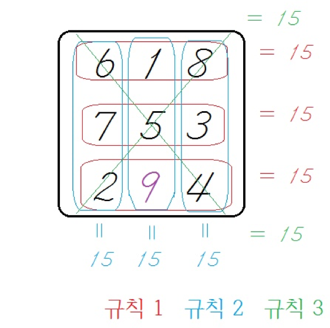

## 문제

우주의 인구를 반으로 줄이려는 악당 타노진스는 우주의 인구 수를 조절할 수 있는 밸런스 스톤이라는 보석을 차지하려고 한다. 이에 맞서는 씨벤저스 멤버 캡틴 학규는 타노진스보다 먼저 밸런스 스톤을 발견하여 파괴하려고 한다.

밸런스 스톤은 N × N 블록으로 이루어진 숫자 퍼즐을 완성하면 얻을 수 있다. 이 숫자 퍼즐은 1가지 블록의 수가 비어져 있는 상태이며, 규칙을 만족하는 수 M을 블록에 채워넣으면 퍼즐이 완성된다. 규칙은 다음과 같다.

[ 규칙 ]

1. M을 채워넣었을 때 같은 행에 있는 수의 합은 모두 같아야 한다.
2. M을 채워넣었을 때 같은 열에 있는 수의 합은 모두 같아야 한다.
3. M을 채워넣었을 때 블록의 대각선의 있는 수들의 합도 모두 같아야 한다.
4. 규칙 1, 2, 3의 합은 모두 같아야 한다.
5. 어떠한 수를 M에 넣어도 규칙 1, 2, 3을 만족하지 못한다면 -1을 블록에 채워 넣으면 블록이 완성된다.

캡틴 학규를 도와 퍼즐을 완성하고 우주의 평화를 지키자

## 입력

입력의 첫째 줄에 맵의 크기 N(2 ≤ N ≤ 500)이 주어진다. 다음 N줄에 각 블록의 수 k가 N개가 주어진다. (1 ≤ k ≤ 1,000,000,000의 자연수), 비어있는 블록은 수 0으로 주어지며 조건을 만족하는 수 M이 존재할 시 무조건 자연수 값이 되도록 주어진다.

## 출력

퍼즐의 조건을 만족하는 수 M을 출력한다.
