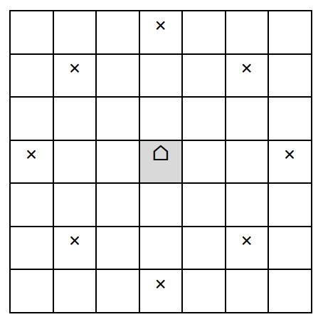
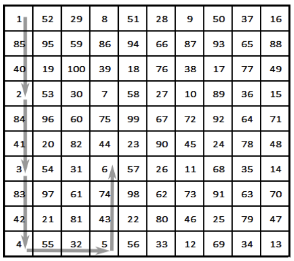

## 문제

Let’s describe a new “chess” piece and call it “camel-tone”. The piece moves jumping: horizontally or vertically – over two chessboard squares, or diagonally – over one square. The picture shows a part of the board with a camel-tone, placed in the center and the positions (marked by x), where it can go with one move. Of course, it cannot go outside the playing board, which happens to be a big square, divided into N×N little squares. In this task N is always divisible by 5.

The camel-tone starts at the square in the top-left corner of the board. The game consists of making a sequence of moves on the board, visiting every square exactly once. Moreover, after N2-1 moves the piece should be exactly one move away from its starting position. This is a so-called “camel-tonian cycle”!

Write a program camel to find any possible way to play the game, or to report that the cycle is impossible.

## 입력

A single line is read from the standard input, containing only one integer N.

## 출력

The program has to write to the standard output:

* one line with the message NO, if you establish that the cycle is impossible

or

* N lines, each containing N space separated numbers, which are the different positive integers between 1 and N2 inclusive. The first number in the first line is 1. The output represents the playing board (N×N squares), where integers indicate the consecutive occupied positions. See the example below.

## 힌트

Explanation: The camel-tone starts at the top left position (row:1, column:1), numbered 1. The second occupied position is (row:4, column:1), so it is numbered 2. The next position is (row:7, column: 1), and it is numbered 3, and so on. The final (hundredth) occupied position is (row:3, column:3), and it is at one move away from the starting position.

