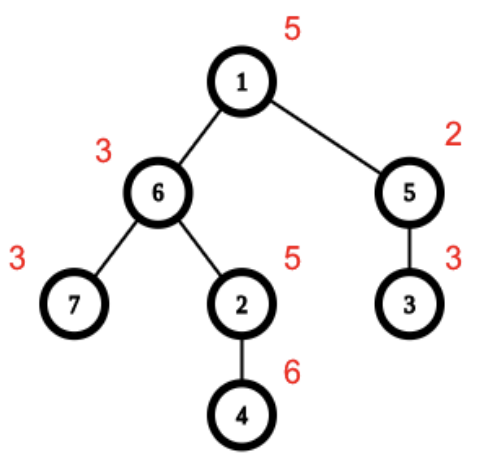

## 문제

Company X has N employees. The company has a strict hierarchical tree-like structure – the CEO (Chief Executive Officer) stands at the top (root of the tree), he has some number of direct subordinates, who also have direct subordinates and so on, until we reach regular employees, who have no subordinates (leaves of the tree).

The employees are numbered with integers from 1 to N. The CEO has number 1, but the other numbers have nothing to do with the hierarchy. Each employee has some experience – the i-th employee has experience, denoted by non-negative integer Wi.

The company has a large number of group projects to complete and the management has decided to split all of the employees into different groups (teams), so that the following conditions are satisfied:

* Each team must consist of at least one person and each person must belong to exactly one team.
* Each team must consist only of people, who are consecutive subordinates of one another. A group of employees j1, j2, j3, j4 … is a valid team if j2 is directly subordinate of j1, j3 is a directly subordinate of j2, j4 is directly subordinate of j3 and so on.

The management knows that after a group project is finished, the total experience of the group, assigned to the project, increases by Wmax − Wmin, where Wmax is the maximal experience, and Wmin is the minimal experience among the group members. The total experience increase for the company is equal to the sum of the experience increases of all teams. The management wants to maximize the total experience increase for the company, by splitting the employees into the best possible teams’ configuration, following the two conditions mentioned above.

Write a program experience to calculate the maximum possible experience increase for the company.

## 입력

The first line of the standard input contains a single integer N – number of employees in the company.

The second line contains N space separated non-negative integers W1, W2, … , WN – the experience of each employee of the company.

Then N - 1 lines follow, each containing space separated integers u and v in the mentioned order. These numbers represent the subordinate relations in the company – the employee with number v is a direct subordinate of the employee with number u.

## 출력

The program should print to the standard output one integer – the maximum total experience increase for the company.

## 힌트

One possible configuration that maximizes the total experience increase is {1, 5, 3}, {6, 2, 4}, {7}. There is another configuration with the same maximal total experience increase – {1, 5}, {3}, {6, 2, 4}, {7}.
