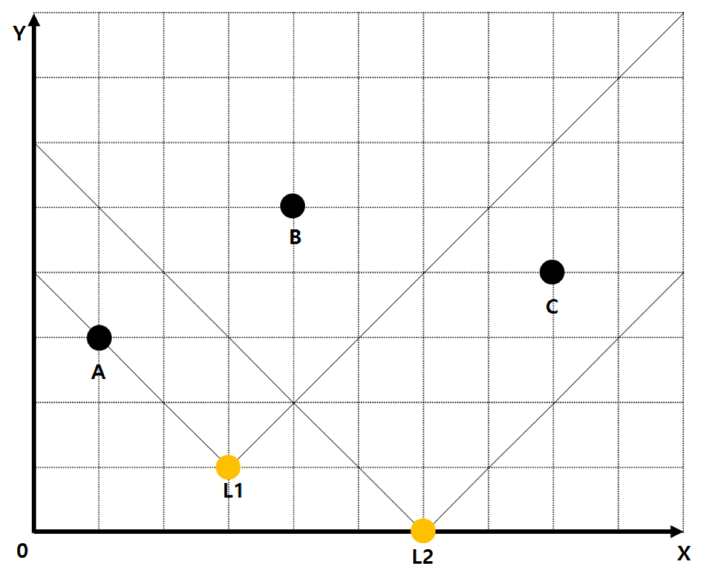

## 문제

사람들은 영우를 존경한다. 영우를 아는 사람이라면 모두 존경할 수 밖에 없는 사실이지만, 안타깝게도 아직도 영우를 모르는 사람들이 있다는 것이 문제다.

윤호는 그 사실이 불편했다. 따라서 모두가 영우를 알 수 있도록 영우가 출몰하는 곳곳에 라이트를 설치하여 스포트라이트를 받게 하려 한다. 모든 라이트를 켠 후 윤호는 영우가 나타났을 때 얼마나 빛날지 궁금했다.

윤호가 설치한 라이트의 위치가 주어진다. 라이트는 항상 북쪽(y 좌표가 증가하는 방향) 방향으로 90도 각도로 비추고 있으며, 아무리 멀어도 빛의 세기는 약해지지 않는다. 윤호가 설치한 라이트는 빛의 세기가 중첩된다. 즉, 2개의 라이트에게 빛을 받는 영역의 세기는 2이고, 3개의 라이트에게 빛을 받는 영역의 세기는 3이 된다.

위의 그림 같은 경우에는 A는 1, B의 경우에는 2, C의 경우에는 1의 세기를 가지고 있다.

라이트가 위치한 곳도 그 라이트의 빛을 받는 영역이다.

## 입력

프로그램의 입력은 표준 입력으로 받는다. 라이트의 개수 N(1 ≤ N ≤ 105) 이 주어지고, 그 다음 N줄에 걸쳐 라이트의 위치를 나타내는 좌표인 두 정수 Xi, Yi (-1500 ≤ Xi, Yi ≤ 1500)가 주어진다.

그 다음 P(1 ≤ P ≤ 105)가 주어진다. 이어서 P개의 줄에 걸쳐서 Xpi , Ypi (-1500 ≤ Xpi, Ypi ≤ 1500)가 주어지는데, 이는 윤호가 빛의 세기를 알고 싶어하는 지점들의 X좌표, Y좌표이다.

## 출력

프로그램의 출력은 표준 출력으로 한다. P개의 수를 한 줄당 하나씩 출력한다. i번째 줄에는 지점 (Xpi, Ypi)의 빛의 세기를 출력하면 된다.
