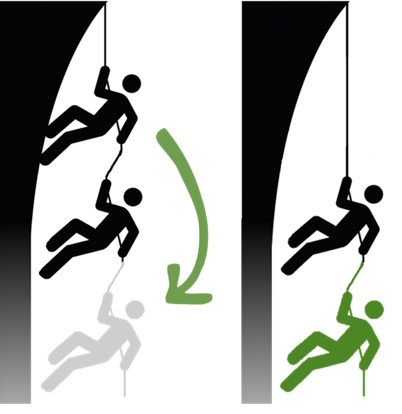
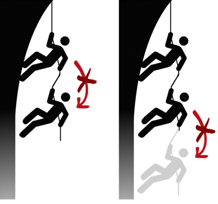
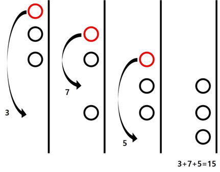
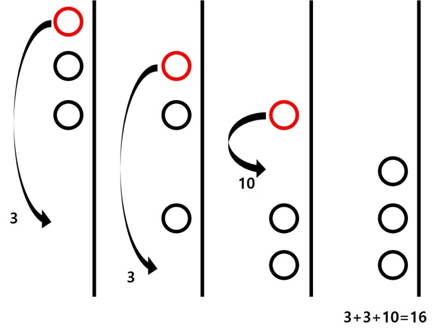

## 문제

남제관의 중앙에 싱크홀이 발생했다. 돌이 바닥에 닿는 데 까지 걸리는 시간을 통해 깊이를 구해낸 1333 패밀리. 호기심을 뒤로하고 떠날 수 있을 리가 없다. 이들은 주헌이가 취미생활을 위해 가지고 있던 로프를 빼앗아 탐험을 시작 하고자 한다.

그림 1. 아래로 내려갈 수 있는 경우 예시(좌) / 내려갈 수 없는 예시(우)

길이 L짜리의 로프를 사용해 1~L 만큼 아래로 내려갈 수 있다. 이때 i 만큼 내려간다면 xi 만큼 에너지를 소모한다. 로프는 주헌이가 취미를 즐기기엔 충분히 길지만, 안전하게 내려가기엔 너무 짧아 매번 맨 위에 있는 사람만 이동하기로 한다. 당연하게도 다른 사람이 있는 곳으로는 이동할 수 없다.

구멍의 입구로 부터 떨어진 거리를 깊이라고 할 때, 탐험을 시작할 때 1333 패밀리는 깊이 1, 2, ..., n에 차례로 매달려 시작한다. 바닥에 도착 했을 때 또한 깊이 D, D-1, ... ,D-n-1 로 모두가 바닥부터 차례로 있어야 한다. 이때, 그들의 순서는 고려하지 않는다.

1333 패밀리는 바닥에 도착할 때까지 소모하는 에너지를 최소로 하고자 한다. 이때 소모하게 되는 최소 에너지가 얼마인지 구해보자.

## 입력

탐험을 떠나는 사람 N, 동굴의 깊이 D, 로프의 길이 L이 주어진다. 두 번째 라인에 내려가기 위해 드는 에너지 xi를 L번에 걸쳐 입력 받는다.

## 출력

1333 패밀리가 바닥에 도착할 때까지 소모하는 에너지의 최솟값을 출력한다.

## 힌트

2번 예제는 Small에서는 나오지 않는다.

2번 예제를 그림으로 표현하면 아래와 같다.

왼쪽이 최소의 에너지로 도착하는 경우, 오른쪽은 도착은 하지만 최소 에너지는 아닌 경우이다.

