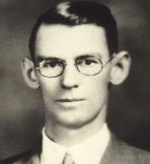

## 문제

The Stroop effect is a phenomenon that occurs when you must say the color of a word but not the name of the word. When the name of a color (e.g., "blue", "green", or "red") is printed in a color that is not denoted by the name (e.g., the word "red" printed in blue ink instead of red ink), naming the color of the word takes longer and is more prone to errors than when the color of the ink matches the name of the color. The effect is named after John Ridley Stroop, who first published the effect in English in 1935. The original paper has been one of the most cited papers in the history of experimental psychology, leading to more than 700 replications. The effect has been used to create a psychological test (Stroop test) that is widely used in clinical practice and investigation.

Stimuli in Stroop paradigms can be divided into 2 groups: congruent and incongruent. Congruent stimuli are those in which the ink color and the word refer to the same color (for example the word "red" written in red ink). Incongruent stimuli are those in which ink color and word differ (for example the word "blue" written in red ink). There are four primary color in Stroop test namely; blue, yellow, red and green. In Stroop test, a number of stimuli from both group will be randomly displayed, one by one. Each time it is displayed, the patient need to respond on the correct color, not the word. In addition, the number of stimuli group in Stroop test are the same for both congruent and incongruent. The number of each color in congruent group and incongruent group must be the same. In addition, the combination of word-color in incongruent group must be the same. must be the same, Also, only one consecutive same ink color or word color are allowed.

For example, stimuli frequency is as follows:

| Word-Color | Color=blue | Color=yellow | Color=green | Color=red |
| --- | --- | --- | --- | --- |
| Word=blue | 3 | 1 | 1 | 1 |
| Word=yellow | 1 | 3 | 1 | 1 |
| Word=green | 1 | 1 | 3 | 1 |
| Word=red | 1 | 1 | 1 | 3 |

Overall number of stimuli is 24. Number of congruent stimuli equals to incongruent stimuli that is 12. Incongruent stimuli for each color of each word is the same that is 1.

Stimuli sequence is invalid if exist more than one consecutive same color or same word, eg: … blue-blue, green-blue, red-blue ...

Given a sequence of two digits, your task is to identify whether the sequence fulfills Stroop test stimulus. The digit 1 – 4 represents four primary color, the first digit represent the word color, and the second digit represent the ink color.

## 입력

The first line of input is an integer N (1 ≤ N ≤ 50) that represents the number of test case, followed by N lines where each line of input contains a sequence of two digit integers 1, 2, 3 or 4. The line end with number 00. The sequence length is not more than 500.

## 출력

For each test case, the output contains a line in the format Case #x: result, where x is the case number (starting from 1) and result is either Stroop or Not Stroop.
