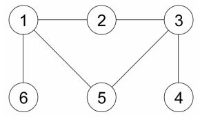

## 문제

There are N cities (numbered from 1 to N) connected by M bidirectional roads such that from any city, it is possible to reach any other cities with one or more roads. The i-th city has an economic value of Si, and each road directly connects two different cities.

There are Q queries, which should be executed one by one, each represented by a tuple (Ai, Bi, Ci).

1. If Ai = 0, then you need to change the economic value of city Bi to Ci.
2. If Ai = 1, then you need to output the answer to the following question: Suppose there are two businessmen, one of them is in city Bi, while the other is in city Ci. They both agree to each other on a non-negative integer X, where X is the number of days in which they are moving around. Each day, both businessmen move to any city adjacent to the current city they are in, and they repeat this routine for X days. They cannot stay in the same city for two consecutive days, but they may revisit cities which have been visited before. After X days, they should be in the cities such that the difference of the economic value between those two cities are minimum. Output the minimum difference. Note that the two cities can be the same city.

## 입력

The first line contains two integers: N M (1 ≤ N ≤ 100,000; 1 ≤ M ≤ 200,000) in a line denoting the number of cities and roads. The second line contains N integers: S1 S2 ... SN (0 ≤ Si ≤ 1,000,000,000) in a line denoting the economic value of each city. The next M following lines, each contains two integers: ui vi (1 ≤ ui, vi ≤ N; ui ≠ vi) in a line, which means the i-th road connects city ui and city vi. It is guaranteed that from any city, it is possible to reach any other cities by using one or more roads. The next line contains an integer: Q (1 ≤ Q ≤ 100,000) denoting the number of queries. The next Q lines, each contains three integers: Ai Bi Ci (0 ≤ Ai ≤ 1) in a line denoting the queries. For each query, if Ai = 0, then 1 ≤ Bi ≤ N and 0 ≤ Ci ≤ 1,000,000,000; otherwise 1 ≤ Bi, Ci ≤ N. There will be at least one query where Ai = 1.

## 출력

For each query where Ai = 1, output the minimum difference of the economic value of the two cities that can be reached by the businessmen after X days, in a line. Note that the value of X is any nonnegative integer and independent between different queries.

## 힌트

Explanation for the 1st sample case

The following are the road configuration and the queries for the first sample:

* Originally all cities have an economic value of 0.
* 1st query: 1 1 2. As the economic value of all cities is the same (i.e. 0), then they can decide on any X and move to any cities they want; the difference will be 0.
* 4th query: 1 1 2. This query is the same as the 1st query, but now city 1 has an economic value of 10 (due to the 2nd query), while city 3 has an economic value of 20 (due to the 3rd query). The minimum difference of 10 can be achieved if they choose X to be 0. Follows are some examples where the difference is NOT minimum:
  + X = 1, the first businessman moves from city 1 to city 5 (with an economic value of 0), while the second businessman moves from city 2 to city 3 (with an economic value of 20). The difference of the economic value of the two final cities is 20.
  + X = 2, the first businessman moves from city 1, to city 5, to city 3 (with an economic value of 20), while the second businessman moves from city 2, to city 3, to city 4 (with an economic value of 0). The difference of the economic value of the two final cities is 20.
  + It is possible to achieve a minimum difference of 10 with X = 1, e.g., the first businessman moves from city 1 to city 2 (with an economic value of 0), while the second businessman moves from city 2 to city 1 (with an economic value of 10). It is also possible to achieve this with X = 2, e.g., the first businessman moves from city 1, to city 5, to city 1 (with an economic value of 10), while the second businessman moves from city 2, to city 3, to city 2 (with an economic value of 0). Among all possible moves, the minimum difference which can be achieved in this case is 10.
* 6th query: 1 1 3. The two businessmen can choose X = 1 and move to city 2 (or city 5) altogether.
* 7th query: 1 1 6. They can choose X = 3 and move such that the final cities are city 4 (with an economic value of 11) and city 1 (with an economic value of 10).
