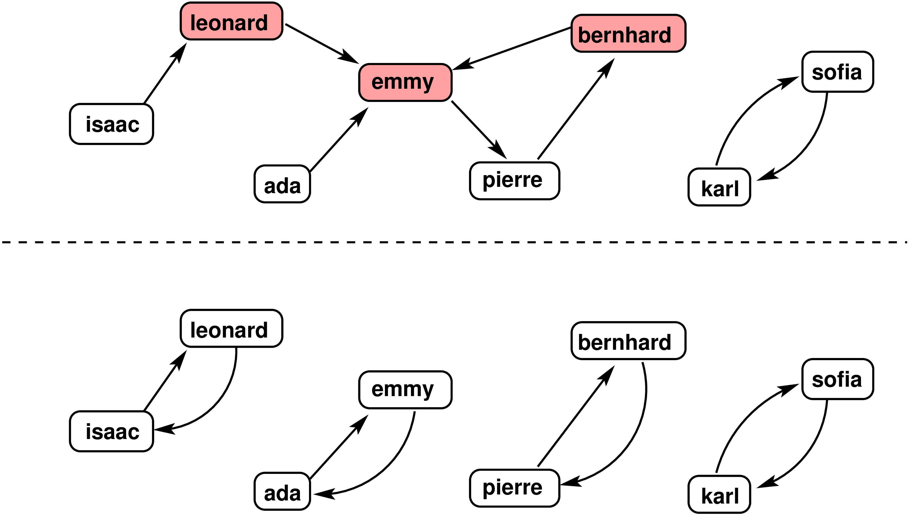

## 문제

As we all know, TV soap operas with many characters can lead to seriously complicated love dramas. In one TV show, there are N characters. Each character loves exactly one character (which could actually be him- or herself). We say that two characters are in a relationship if and only if they love each other.

One particular type of complication is called a “love polygon”. We say that 3 or more characters are in a “love polygon” if the first character loves the second, the second loves the third and so on, and also the last character loves the first.

Recent polling has shown that viewers have grown tired of this drama and would prefer something more romantic. Therefore, it was decided to shoot some characters with love arrows so that everyone is in a relationship. By shooting someone with a love arrow, you can change whom that character loves (to any character of your choice).

What is the least number of love arrows needed to get everyone into a relationship?

## 입력

The first line of the input contains the integer N, the number of characters involved. The next N lines all contain two space-separated names s and t, meaning that the character named s initially loves the character named t. Names of the characters are no more than 10 letters long and consist of lowercase English letters.

## 출력

Output one integer – the minimum number of love arrows needed to get everyone into a relationship. If this is not possible, output -1.

## 힌트

The first example is illustrated in the figure above. The upper part shows the initial love situation, where an arrow pointing from s to t indicates that s initially loves t, and the pink color highlights the three characters that needs to be shot with love arrows in the unique optimal solution. The lower part shows the situation afterwards.

In the second example (which satisfies the constraints of group 3), there are several optimal solutions. One of them is to shoot a, b and d with love arrows, and have them fall in love with b, a and c, respectively.

In the third example, we have a love triangle, where no matter how many love arrows we shoot, someone will always be left out.
