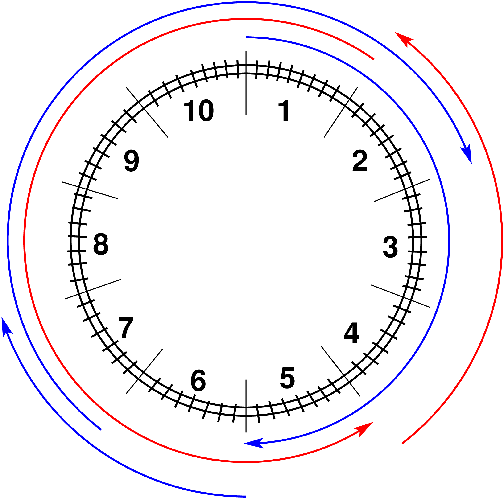

## 문제

Fredrik is at home, playing with a custom-built model railway which he is very proud of. The railway consists of N segments connected in a circle, numbered 1,2,…,N in clockwise order. Electricity to the train is provided through M curved wires that pass along the circle. Each segment has at least one wire that goes along it.

However, Fredrik is becoming bored with his circling train and decides to add a train switch to every segment, which he could use to cause derailing accidents and other exciting scenarios. But the switches also need electricity. And not just any kind of electricity; they specifically need alternating current.1

The way you get alternating current, Fredrik figures, is by having current that goes in both directions. Each wire only gives current in one direction (either clockwise or counter-clockwise) but Fredrik is free to decide which. Thus, what he wants to do is to make a decision about the direction of the current in each wire, so that every track segment is covered by both a wire with clockwise-directed current and a wire with counter-clockwise-directed current.

Can you help Fredrik with this task?

A solution to the first sample. The curved arrows outside the railway represent the wires that provide electricity. The direction of each arrow represents Fredrik’s choice of direction of the current (with the blue and red colors emphasizing the different directions). Note that all arrows could have been reversed to get the other valid solution: 11010.

1This makes sense because the railway is a Swedish one – in Sweden, all train switches (“växlar”) use alternating current (“växelström”).

## 입력

The first line contains two integers N and M, the number of railway segments and the number of wires, respectively.

The next M lines each contains two numbers 1 ≤ a, b ≤ N, indicating that there is a wire that covers segments a,a+1,…,b. If b is smaller than a, it means that the sequence wraps around, i.e. segments a,…,N,1,…,b are covered. Note that if a = b, the wire covers only one segment.

## 출력

Output a single line with M characters, each being either 0 or 1. The ith character of the line should be 0 if the current in the ith wire given in the input should be directed clockwise, or 1 if it should be directed counter-clockwise. If there are multiple solutions you may output any of them.

If there is no valid solution, output “impossible”.
