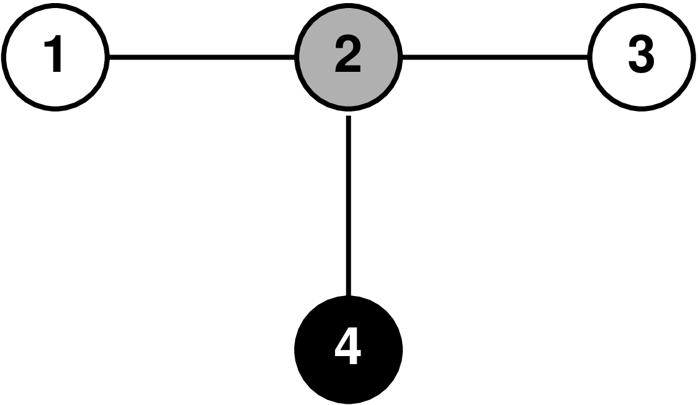

## 문제

A graph is a mathematical structure which consists of a set of vertices, and a set of edges, each connecting two vertices. An example of a graph with 4 vertices and 3 edges is shown in the sample explanation below.

A path in the graph is defined as an ordered list of 2 or more vertices, such that there are edges between consecutive vertices in the list. In this task we are only interested in simple paths in which no vertex occurs more than once. Note that the list is ordered; for example, “5-6-7”, “5-7-6” and “7-6-5” are all treated as different paths.

In this task, each vertex in the graph has one of K colors. The task is to find the number of possible (simple) paths in which no two vertices have the same color.

## 입력

The first line of input contains three integers: N (the number of vertices), M (the number of edges), and K (the number of different colors).

The second line of input contains N integers between 1 and K – the colors of each vertex (starting with vertex 1 and ending with vertex N).

Each of the following M lines describes an edge and contains two integers a,b (1 ≤ a, b ≤ N,a ≠ b) – the two vertices connected by the edge. There will be at most one edge between any two vertices.

## 출력

Output one integer – the number of paths whose vertices all have distinct colors. This number will always be smaller than 1018.

## 힌트

The graph in the first example is illustrated in the figure, where each vertex has been filled with white (color 1), gray (color 2) or black (color 3). There are 10 paths whose vertices all have distinct colors: “1-2”, “2-1”, “2-3”, “3-2”, “2-4”, “4-2”, “1-2-4”, “4-2-1”, “3-2-4” and “4-2-3”.

Note that “1” is not allowed as a path, because it is a single vertex, nor is “1-2-3”, because it contains two nodes of color 1.
