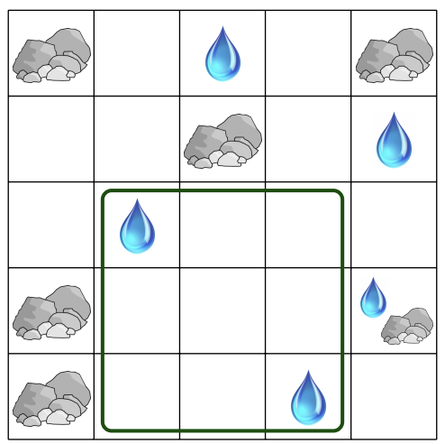

## 문제

When camping in the highlands of the Nordic countries, having a reliable source of water can be a matter of life and death. Traditionally Nordic campers have always pitched their tents over a water source such that water can be fetched at any time without having to go outside. Another bizarre tradition of the Nordic people is their tents. They only use square tents.

The campsites in the Nordic highlands can be very rough and rocky. Jon is currently setting up a new campsite and has surveyed all the usable spots on the campsite. Modeling the campsite as an N by M grid, Jon gives you a list of all the cells that are rough, and thus unusable. Jon now wants to figure out what is the largest tent that can be pitched on his campsite, only making use of smooth, usable cells, so that it covers a given water source.

For each water source, can you help Jon determine the size of the largest square tent that can be pitched so that it covers that particular water source?

Figure 1: The second example test case and the area of the largest square tent that covers the water source at (3, 2). This also happens to be the largest square tent that covers the water source at (5, 4).

## 입력

The first line of input contains two space separated integers N and M (1 ≤ N, M). Then follow N lines, each consisting of M characters, representing the grid. Each character is either ‘#’ or ‘.’, where ‘.’ represents a smooth area of the campground and ‘#’ represents a rocky unusable area.

Then follows a line with a single integer Q, the number of water sources Jon has under consideration. Each of the following Q lines contains two integers x and y (1 ≤ x ≤ N, 1 ≤ y ≤ M), giving the location (x, y) of a water source (a water source in row x, column y of the grid).

## 출력

For each water source Jon has under consideration, in the same order as in the input, output the ground area of the largest square tent that can be pitched on smooth, usable cells so that it covers that particular water source.

Note that the tent may not be pitched so that it partially covers a cell. Either it covers it completely, or has an empty intersection with the cell.
