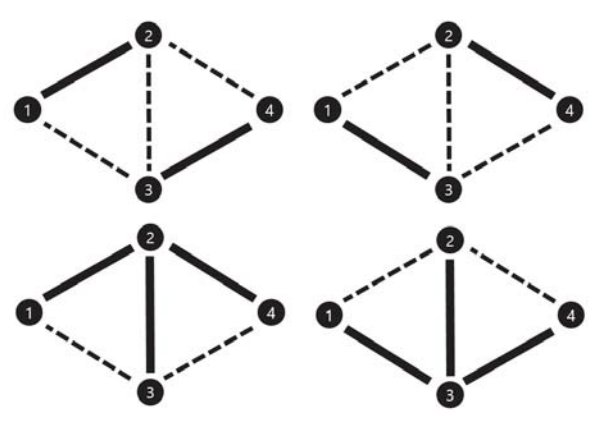

## 문제

무방향 그래프 G가 주어진다. 이 그래프에는 self edge는 존재하지 않지만 multi edge는 존재한다. 즉, 자기 자신으로 가는 edge는 없지만, 특정 점으로 가는 edge가 여러 개 존재할 수 있다. 이때, 그래프 G의 edge들 중 몇 개를 골라서 색칠하려고 한다. 이때, 다음 조건을 만족해야 한다.

* G의 모든 vertex에 대하여, 그 vertex에 인접한 색칠된 edge들의 개수가 항상 홀수여야 한다. (만약 0개일 경우, 이는 짝수로 취급한다.)

이 조건을 만족하도록 edge를 색칠하는 방법의 개수를 108 + 7로 나눈 나머지를 출력하시오.

## 입력

첫 번째 줄에 n과 m이 주어진다. n은 그래프 G의 vertex 개수, m은 그래프 G의 edge 개수다. (1 ≤ n ≤ 100, 0 ≤ m ≤ 800)

두 번째 줄부터 m + 1번째 줄까지 u, v가 주어진다. (u ≠ v, 1 ≤ u, v ≤ n)

i+1(1 ≤ i ≤ m)번째 줄의 u, v는 i번째 edge가 u와 v를 잇는 edge라는 것을 의미한다.

그래프 G의 vertex는 번호가 1부터 n까지 매겨져 있다.

## 출력

조건을 만족하도록 색칠하는 방법을 108+7(100,000,007)로 나눈 나머지를 출력한다.

## 힌트

다음 그림에 나타난 네 가지 경우만 가능하다. 점선은 선택하지 않은 간선, 실선은 선택한 간선을 의미한다.

