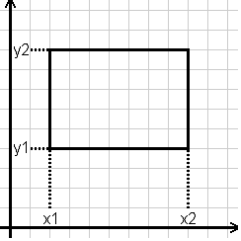
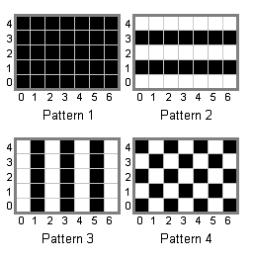

## 문제

민식이는 영식이의 손가락을 부러뜨렸다. 민식이는 너무 미안한 마음에 영식이에게 자신의 미안한 마음을 담은 편지를 벽에 붙이려고 한다. 영식이와 민식이의 집은 매우 크다. 민식이의 편지는 1X1크기의 정사각형이다. 벽은 가장 왼쪽 아래를 좌표에서 원점으로 한다. X축은 왼쪽에서 오른쪽으로 양의 방향이고, Y축은 아래에서 위로 양의 방향이다.

처음에 모든 칸은 편지를 붙이지 않았다. 민식이는 편지를 다음과 같은 방법으로 붙이려고 한다. 민식이는 (x1,y1)을 왼쪽 아래로 하고, (x2,y2)를 오른쪽 위로 하는 직사각형에 편지를 붙일 것이다. 민식이는 미적감각이 뛰어난 영식이를 위해서 편지를 붙이는 총 4가지 방법중에 하나로 붙이려고 한다.

 

1. 첫 번째 방법은 모든 칸에 전부 편지를 붙이는 방법이다.
2. 두 번째 방법은 직사각형의 홀수 행에 모두 편지를 붙이는 방법이다.
3. 세 번째 방법은 직사각형의 홀수 열에 모두 편지를 붙이는 방법이다.
4. 네 번째 방법은 홀수 행이면서 홀수 열이거나, 짝수 행이면서 짝수 열인 칸에 편지를 붙이는 방법이다.

민식이가 편지를 다 붙였을 때, 벽에 편지가 총 몇 개 붙여있는지 개수를 구하는 프로그램을 작성하시오. 편지가 이미 붙어있는 칸에는 다시 편지를 붙이지 않는다.

## 입력

첫째 줄에 직사각형의 개수 N이 주어진다. N은 100보다 작거나 같은 자연수이다. 둘째 줄부터 N개의 줄에 직사각형의 정보가 주어진다. 직사각형의 정보는 x1 y1 x2 y2 p 와 같이 주어진다.

(x1,y1)은 직사각형의 왼쪽 아래 점이고, (x2,y2)는 직사각형의 오른쪽 위 점이다. p는 민식이가 편지를 붙이는 방법인데, 문제에 나온 1~4중에 하나다. x1은 x2보다 반드시 작고, y1은 y2보다 반드시 작다. 그리고, x1,y1,x2,y2는 40,000보다 작거나 같은 자연수이다.

## 출력

첫째 줄에 편지가 총 몇 개 붙여있는지 개수를 출력한다.

## 힌트

방법 1과 2로 채우는 10\*10크기의 직사각형과(100개의 검정칸), 방법 3과 4로 채우는 10\*10크기의 직사각형(75개의 검정칸)이다. 두 직사각형은 서로 3개의 검정칸을 공유하므로 정답은 100+75-3=172이다.
