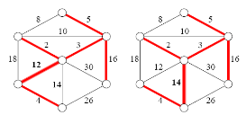

## 문제

방향성이 없는 그래프 G가 주어진다. 문제는 G의 최소 스패닝 트리보다는 크면서 가장 작은 스패닝 트리인 'The second minimum spanning tree'를 구하는 것이다.

MST와 second MST의 모습

## 입력

첫째 줄에 그래프의 정점의 수 V(1 ≤ V ≤ 50,000)와 간선의 수 E(1 ≤ E ≤ 200,000)가 들어온다. 둘째 줄부터 E+1번째 줄까지 한 간선으로 연결된 두 정점과 그 간선의 가중치가 주어진다. 가중치는 100,000보다 작거나 같은 자연수 또는 0이고, 답은 231-1을 넘지 않는다.

정점 번호는 1보다 크거나 같고, V보다 작거나 같은 자연수이다.

## 출력

두 번째로 작은 스패닝 트리의 값을 출력한다. 만약 스패닝 트리나 두 번째로 작은 스패닝 트리가 존재하지 않는다면 -1을 출력한다.
