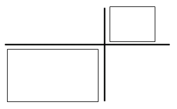

## 문제

N개의 직사각형이 좌표 위에 흩어져 있고 이 중 몇 개의 직사각형을 선택하여 집합 L을 구성하려 한다. 집합 L의 조건은 아래와 같다.

왼쪽 아래의 점을 시작점, 오른쪽 위의 점을 끝점이라고 정의 할 때, 집합의 임의의 두 원소 p, q에 대하여 p의 끝점 x좌표가 q의 시작점 x좌표보다 작고 마찬가지로 y좌표도 작거나 또는 q의 끝점 x좌표가 p의 시작점 x좌표보다 작고 y좌표 역시 작아야 한다.

문제는 위의 조건을 만족하는 집합의 최대 원소 개수를 구하는 것이다.

## 입력

첫째 줄에 직사각형의 개수 N(1 ≤ N ≤ 100,000)이 주어진다. 둘째 줄부터 N+1번째 줄까지 i+1번째 줄에 i번째 직사각형의 왼쪽 아래 점의 x좌표, y좌표 오른쪽 위의 점의 x좌표, y좌표를 나타내는 4개의 정수가 공백으로 구분되어 주어진다. 왼쪽 아래 점의 x, y좌표는 오른쪽 위의 x, y좌표보다 항상 작다. (0 ≤ x, y ≤ 100,000)

## 출력

첫째 줄에 집합의 최대 원소 개수를 출력한다.
