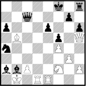

## 문제

In the FEN (Forsyth-Edwards Notation), a chessboard is described as follows:

* The Board-Content is specified starting with the top row and ending with the bottom row.
* Character / is used to separate data of adjacent rows.
* Each row is specified from left to right.
* White pieces are identified by uppercase piece letters: PNBRQK.
* Black pieces are identified by lowercase piece letters: pnbrqk.
* Empty squares are represented by the numbers one through eight.
* A number used represents the count of contiguous empty squares along a row.
* Each row's sum of numbers and characters must equal 8.

For example:

* 5k1r/2q3p1/p3p2p/1B3p1Q/n4P2/6P1/bbP2N1P/1K1RR3

is the FEN notation description of the following chessboard:

The chessboard of the beginning of a chess game is described in FEN as:

* rnbqkbnr/pppppppp/8/8/8/8/PPPPPPPP/RNBQKBNR

Your task is simple: given a chessboard description in a FEN notation you are asked to compute the number of unoccupied squares on the board which are not attacked by any piece.

## 입력

Input is a sequence of lines, each line containing a FEN description of a chessboard. Note that the description does not necessarily give a legal chess position. Input lines do not contain whitespace.

## 출력

For each line of input, output one line containing an integer which gives the number of unoccupied squares which are not attacked.
