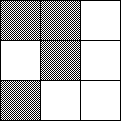
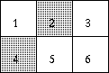
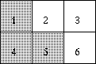
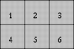

## 문제

'강화보안기구'라는 회사는 아주 복잡한 전자암호와 보안장치를 만들고 있습니다.

최근 만든 발명품은 R개의 행과 C개의 열로 된 보안 패널입니다. 왼쪽부터 오른쪽으로 숫자가 매겨져 있고, 왼쪽 위가 1, 오른쪽 아래가 R x C로 번호가 매겨져 있습니다. 두 가지 상태로 이루어져 있는데, 켜진 상태와 꺼진 상태입니다. 이 버튼을 누르면 신호가 꺼짐에서 켜짐으로 바뀌거나 켜짐에서 켜짐을 바뀝니다. 한 버튼을 누르면 그 버튼을 중심으로 한 패턴에 따라 신호가 바뀝니다. 이 보안 패널를 해제하려면 모든 버튼이 켜져 있어야 합니다.

예를 들어, 만약 한 버튼을 누르면 누른 버튼과 그 버튼의 위 버튼, 왼쪽 위 버튼, 왼쪽 아래 버튼이 신호가 바뀐다면 가운데 버튼을 눌렀을 때 이렇게 됩니다 :

만약 이 패턴을 2 x 3 보안 패널에 적용시킨다면 2,5,6번 버튼을 누르면 모든 버튼을 킬 수 있습니다. 이것이 과정입니다 :

  

## 입력

첫째 줄은 패널의 넓이 R,C(1<=R,C<=5)가 주어지고, 다음 세 줄은 어떤 패턴으로 신호가 바꾸는지를 입력해 줍니다. "\*"이 가운데 버튼을 눌렀을 때 신호가 바뀌는 버튼이고, "."은 변하지 않는 버튼입니다.

"0 0" 한 줄로 입력을 받으면 입력이 끝납니다.

## 출력

각 케이스마다 "Case # Ti"로  출력한 후(지금이 Ti번째 테스트 케이스를 실행하고 있을 때), 만약 가능하다면 누른 버튼을 공백을 하나씩 두고 오름차순으로 출력하고 불가능하다면 "Impossible."이라고 출력합니다. 누른 버튼을 출력할 때에는 최소 횟수를 출력합니다.

가능한 정답이 여러 가지인 경우에는 출력할 수열을 뒤집은 결과가 사전순으로 가장 앞서는 수열을 출력해야 한다.
