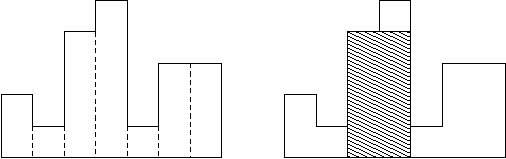

## 문제

히스토그램은 직사각형 여러 개가 아래쪽으로 정렬되어 있는 도형이다. 각 직사각형은 같은 너비를 가지고 있지만, 높이는 서로 다를 수도 있다. 예를 들어, 왼쪽 그림은 높이가 2, 1, 4, 5, 1, 3, 3이고 너비가 1인 직사각형으로 이루어진 히스토그램이다.

히스토그램에서 아래와 같은 쿼리 Q개를 수행해보자.

* `l r w`: l번째 직사각형부터 r번째 직사각형까지만 있을 때, 너비가 w이면서 가장 넓이가 큰 직사각형의 높이를 출력한다.

## 입력

첫째 줄에 직사각형의 수 N이 주어진다. 둘째 줄에는 N개의 정수 h1, ..., hn 가 주어진다. 이 숫자들은 히스토그램에 있는 직사각형의 높이이며, 왼쪽부터 오른쪽까지 순서대로 주어진다. 모든 직사각형의 너비는 1이다.

셋째 줄에는 쿼리의 수 Q가 주어진다. 넷째 줄부터 Q개의 줄에는 쿼리가 주어진다.
