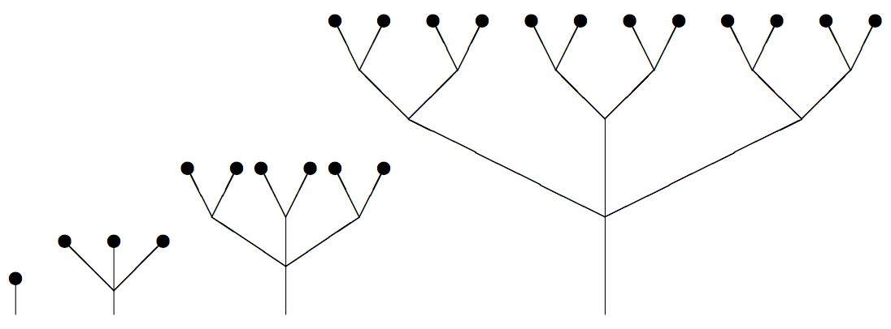

## 문제

branchorama 나무는 특이한 규칙을 가지고 성장합니다. 어린 branchorama 초목은 하나의 잎을 꼭대기에 가진 가는 묘목이며, 그 잎에는 생장점이 있습니다. 성장하는 계절 동안 나무의 생장점들은 여러 개의 가지로 나뉘게 되며, 성장이 끝나면 각 가지는 생장점을 가진 하나의 잎을 꼭대기에 매달게 됩니다. 놀랍게도 같은 나무의 모든 생장점들은 같은 숫자(splitting factor)의 가지로 나뉘며, 그 숫자는 해가 지남에 따라 변합니다.

아래의 예는 Brown 씨의 과수원에서 한 branchorama 나무가 유목에서부터 3년간 자란 결과를 보여줍니다.

예시에서 예측할 수 있듯이, branchorama 나무는 과밀하게 성장하는 경향이 있습니다. 따라서 Brown 씨는 매 겨울마다 과도하게 성장한 나무들의 가지를 쳐냅니다. 아래는 가지를 쳐낸  branchorama 나무의 예입니다

branchorama 나뭇잎은 굉장히 크고 광합성에 유리하지만, 오직 생장점이 온전히 보존된 가지의 끝에만 달립니다. 따라서 나무가 버티지 못할 정도로 가지를 쳐내는 일은 없어야 합니다.

Brown 씨는 각 나무가 몇 개의 잎을 가졌는지 알고 싶어합니다. 나뭇잎을 일일이 세는 것은 지루하기 때문에, 각 해(level) 성장기의 splitting factor와 그 해 겨울에 쳐낸 가지의 수를 이용해 Brown 씨에게 나뭇잎의 수를 알려주세요.

## 입력

입력의 각 줄은 하나의 branchorama 나무를 의미합니다.

각 줄은 나무의 나이 a(1 ≤ a ≤ 20)로 시작하며, 그 뒤로 2a 개의 정수가 공백을 두고 주어집니다. 2a 개의 정수는 splitting factor와 가지치기 한 가지의 수가 level 별로 나열된 것입니다.

마지막 줄로  '0'이 주어지며 더 이상의 입력은 없습니다. '0'은 처리하지 않습니다.

## 출력

각 나무에 대하여 나무에 달려있는 잎의 수를 한 줄씩 출력하세요. 나뭇잎의 수가 signed 32-bit integer를 초과하지 않는다고 가정해도 좋습니다.

## 힌트

처음에 심는 것은 가지 하나에 잎이 하나 달린 묘목입니다.
