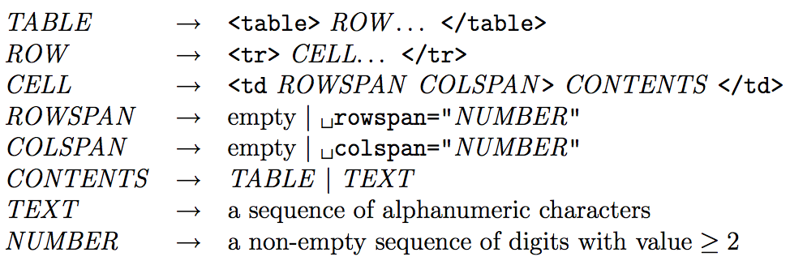
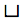
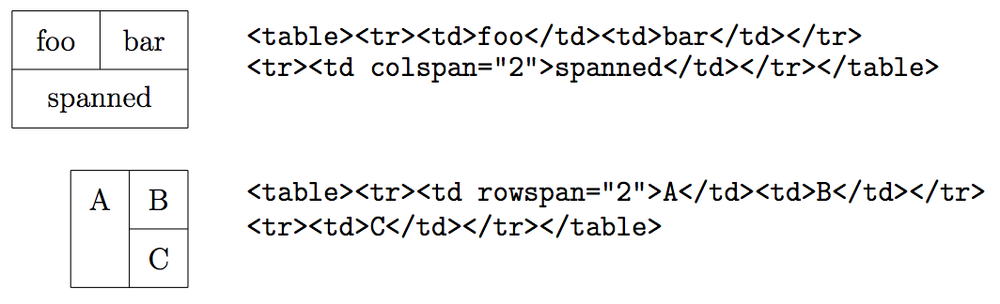
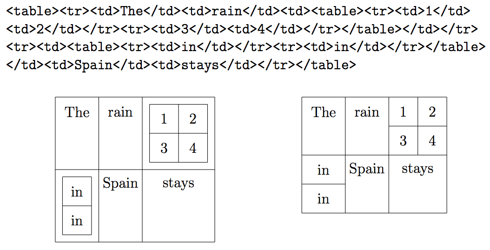
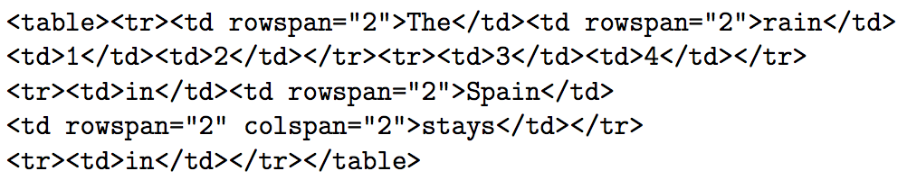

## 문제

Mensa Web Design Ltd specialises in creating table-based HTML layouts for corporate clients. As a new employee at Mensa, you have been asked to tackle a table simplification problem that has been affecting the company. In short, rather than deal with complicated sets of nested HTML tables, Mensa would prefer that they were flattened into single tables containing equivalently laid-out cells.

For the purposes of this task, you will be working with a subset of HTML even smaller than the subset that Mensa generally uses. Your subset includes only very simple text and well-formed tables, and can be described by the following grammar:

(‘. . . ’ indicates that the preceding grammar element may appear in the expansion zero or more times. Whitespace in the grammar is for clarity only; the only whitespace that actually appears in this HTML subset language is the spaces shown explicitly as ‘’ in the ROWSPAN and COLSPAN elements.)

All ROWs in a TABLE will each contain the same number of CELLs, except for when cells are omitted due to preceding spanned cells above them or to their left. For example, the following snippets of HTML source code specify the tables shown alongside them. Notice how in the second example the first cell in the second row is omitted and ‘<td>C</td>’ actually defines the row’s second cell.

Tables can be nested, which occurs when the CONTENTS for one or more cells is another TABLE rather than simply being TEXT. Mensa’s graphic design department produces layouts which never use row or column spans (so their cell start tags are always simply ‘<td>’) but often use nested tables. They will even nest tables within several cells in different areas of a table, but never more than one on the same row or column of the enclosing table.

For example, this HTML source code produces the nested layout shown on the left:

The layout on the right is a single 4 by 4 table containing cells that are laid-out equivalently to the nested layout on the left. (The cells are not the same size or shape, but that is something that will be taken care of by the graphic designer in the final tidying up.) This layout is produced by the following HTML source code:

Your task is to take nested table layouts as produced by the graphic design department and transform them into equivalent layouts using a single table, introducing row and column spans as necessary.

## 입력

Input will consist of a line containing '<body>', followed by any number of lines each containing a nested table layout, one per line, followed by a line containing '</body>'.

Each line except the first and last will contain no more than 10,000 characters, and will consist of a sequence of '<table>', '<tr>', '<td>', '</td>', '</tr>', '</table>', and alphanumeric tokens matching a valid TABLE according to the grammar above. This table will contain no cells with row or column spans, but may contain nested tables. Tables may be nested up to 10 deep, and the resulting equivalent flattened table will contain at least one row and one column and no more than 100 rows and 100 columns. Each TEXT sequence will contain no more than 100 alphanumeric characters.

Output must consist of a line containing '<body>', followed by one line for each input table layout line, followed by a line containing '</body>'.

Each output line except the first and last must contain a flattened table layout equivalent to the nested layout on the corresponding input line. These lines must contain a valid TABLE according to the grammar above, but with the only allowable CONTENTS being TEXT (i.e., without any nested sub-tables); in particular, all ‘HTML tags’ must be in lowercase, and row and column spans must have a single space and quotation marks (and must be omitted if their NUMBER would be ‘1’), as shown in the grammar.
