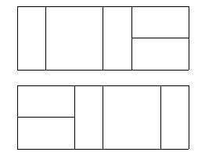

## 문제

2×N 크기의 넓은 판을 1×2 (또는 2×1) 크기와 2×2 크기의 타일로 채우려고 한다. 여러 가지 경우가 있을 수 있으므로, 각각을 하나의 코드로 대응시켜서 암호화에 이용하려고 한다.

그런데 문제가 생겼다. 넓은 판을 교환하다 보니 좌우 대칭인 경우가 있어, 뒤집히는 경우 코드가 헷갈리게 되는 경우가 발생한 것이다. 예를 들어 아래의 두 경우는 달라 보이지만 좌우 대칭을 이루고 있다.

N이 주어지면, 전체 타일 코드의 개수를 구하는 프로그램을 작성하시오. (단, 서로 좌우 대칭을 이루는 중복된 표현은 한 가지 경우로만 처리한다.)

## 입력

첫째 줄에 타일의 크기 N(1 ≤ N ≤ 30)이 주어진다.

## 출력

첫째 줄에 타일 코드의 개수를 출력한다.
