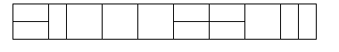

## 문제

2×n 직사각형을 2×1과 2×2 타일로 채우는 방법의 수를 구하는 프로그램을 작성하시오.

아래 그림은 2×17 직사각형을 채운 한가지 예이다.

## 입력

입력은 여러 개의 테스트 케이스로 이루어져 있다. 각 테스트 케이스는 한 줄로 이루어져 있으며, 정수 n이 주어진다.

## 출력

입력으로 주어지는 각각의 n마다, 2×n 직사각형을 채우는 방법의 수를 출력한다.
