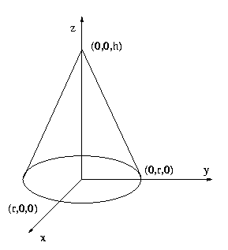

## 문제

원뿔 하나가 평면 z=0에 반지름 r인 밑면을 두고 놓여 있다. 밑면의 중심은 (0,0,0) 이며, 원뿔의 꼭대기는 (0,0,h)에 위치해 있다. 즉, 원뿔의 높이는 h이다.

원뿔상의 점의 위치는 원뿔좌표계에서 다음과 같이 표현된다.

p = (d,A)

이때 d는 원뿔의 꼭대기(0,0,h)로부터의 거리이고,

A는 평면 y=0과 세 점 p, (0,0,0), (0,0,h)를 지나는 평면, 이렇게 두 평면 사이의 각도를 x축의 방향을 기준으로 시계 반대 방향으로 잰 각도이다. (A<360)

이때, 점은 항상 원뿔 위에 있으므로 d는 3차원 좌표계에서의 (0,0,h)와 p의 최단거리와 같다.

원뿔좌표계로 나타낸 원뿔 위의 두 점p1 = (d1, A1) , p2 = (d2, A2) 가 주어진다.

이때, 한 점에서 출발하여 원뿔상의 곡면만을 통해 다른 점까지 도달하는 최단거리는 얼마인가?

## 입력

입력은 여러 테스트 케이스로 이루어져 있다.

각각의 입력 한 줄에 6개의 실수 r, h, d1, A1, d2, A2가 주어진다.

## 출력

각각의 입력마다 두 점간의 원뿔 상의 최단거리를 소수 둘째 자리까지 반올림하여 한 줄에 출력한다.
