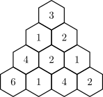

## 문제

In a parallel universe, the most important data structure in computer science is the triangle. A triangle of size M consists of M rows, with the ith row containing i elements. Furthermore, these rows must be arranged to form the shape of an equilateral triangule. That is, each row is centred around a vertical line of symmetry through the middle of the triangle. For example, the diagram below shows a triangle of size 4:

A triangle contains sub-triangles. For example, the triangle above contains ten sub-triangles of size 1, six sub-triangles of size 2 (two of which are the triangle containing (3,1,2) and the triangle containing (4,6,1)), three sub-triangles of size 3 (one of which contains (2,2,1,1,4,2)). Note that every triangle is a sub-triangle of itself.

You are given a triangle of size N and must find the sum of the maximum elements of every sub-triangle of size K.

## 입력

The first line contains two space-separated integers N and K (1 ≤ K ≤ N ≤ 3000).

Following this are N lines describing the triangle. The ith of these lines contains 𝑖 space-separated integers ai,j (0 ≤ ai,j ≤ 109), representing the ith row of the triangle.

For 4 of the 15 available marks, N ≤ 1000.

## 출력

Output the integer sum of the maximum elements of every sub-triangle of size K.
