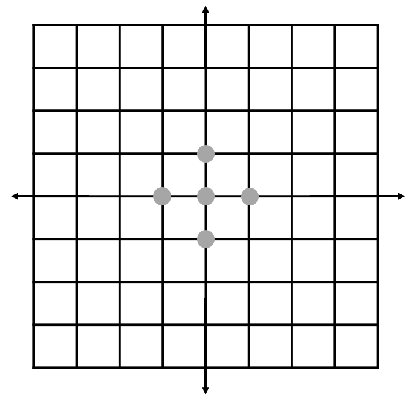

## 문제

“마름모꼴 피자 주세요.” “네?”

맛있는 파인애플 피자를 만드는 병찬이는 예상치 못한 주문에 당황하였다. 그래도 손님의 주문을 따라 최고의 파인애플 피자를 구우려고 한다. 최고의 파인애플 피자를 굽기 위해서는, 총 *N*개의 파인애플이 각각 도우의 특정 위치에 들어가야한다. 이는 2차원 좌표로 나타낼 수 있는데, i 번째 파인애플은 (xi, yi)에 위치해야만 한다. 그리고 손님이 주문한 마름모 모양은 45도 기울어진 정사각형 모양으로, 각 변이 x = y와 x = −y 직선에 평행한 정사각형이라고 볼 수 있다.

병찬이는 손님이 요구한대로 마름모꼴이면서 최고의 파인애플 피자를 구우려고 한다. 그러나 파인애플 피자를 크게 만들면 그만큼 손해가 발생하기 때문에, 가능한 한 피자의 넓이를 최소로 하려고 한다. 병찬이를 도와 *N* 개의 파인애플을 모두 포함하는 가장 작은 마름모꼴 피자를 구워보자.

## 입력

첫 줄에 정수 *N*(2 ≤ N ≤ 200,000)이 주어진다.

두 번째 줄부터 *N* + 1번째 줄까지 정수 xi, yi(−109 ≤ xi, yi ≤ 109)가 주어진다.

## 출력

*N*개의 파인애플을 모두 포함하면서 마름모 꼴인, 가장 작은 최고의 파인애플 피자의 넓이를 출력한다. 만약 넓이가 정수라면, 값을 그대로 출력한다. 만약 넓이가 정수가 아닌 실수라면, 값을 소수 첫째 자리까지만 출력한다.

## 힌트

첫 번째 예제의 파인애플 배치는 위와 같다.
