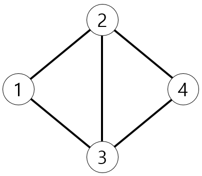
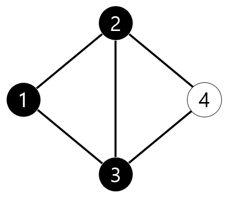
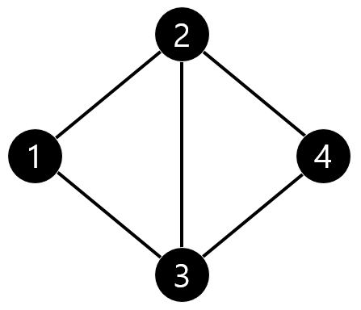

## 문제

병찬이는 파인애플을 매우 좋아하며, 특히 파인애플 피자를 매우 좋아한다. 병찬이는 파인애플 피자의 멋짐을 설파하기 위해 한 마을에 파인애플 피자를 광고를 하려고 한다.

이 마을은 총 *N*개의 집이 있고, 이 *N*개의 집은 모두 파인애플 피자를 싫어한다. 그 리고 이 마을에는 *M*개의 길이 있고, 각 길은 특정 두 집을 연결하고 있다. 길의 구성에 따라, 어떤 집은 어떠한 길과도 연결되어 있지 않을 수 있다. 병찬이는 파인애플 피자를 특정 집에 전해줄 수 있다. 그러면 맛있는 파인애플 피자의 냄새로 인해 파인애플 피자를 전달받은 집과, 그 집과 길로 직접 연결된 집들은 파인애플 피자를 좋아하게 된다.

병찬이는 이 마을에 있는 집 중에 *Q*개의 집에 파인애플 피자를 전해주려고 한다. 물론 한번 피자를 전해준 집에 다시 피자를 전해줄 수 있다. 이 때, 첫 번째 집부터 *Q*번째 집까지 피자를 배달할 때마다 얼마나 많은 수의 집이 파인애플 피자를 좋아하게 되었는지를 알고 싶다. 병찬이를 도와서 얼마나 많은 집이 파인애플 피자를 좋아하게 되었는지 구해보자.

## 입력

첫 줄에 *N*, *M*, *Q*가 주어진다. (1 ≤ *N* ≤ 200,000, 0 ≤ *M* ≤ 1,000,000)

두 번째 줄부터 *M* + 1번째 줄까지 *a*i, *b*i가 주어진다.(1 ≤ *a*i, *b*i ≤ *N*) 이는 집 *a*i와 집 *b*i가 길로 연결되어 있다는 것을 의미한다.

그 뒤 *Q*(1 ≤ *Q* ≤ 200,000)개의 줄에 걸쳐 피자를 전달할 집의 번호 *n*i가 주어진다.

## 출력

*Q*개의 정수를 출력한다. i번째 정수는 병찬이가 집 *n*i에 파인애플 피자를 주었을 때, 새로이 파인애플 피자를 좋아하게 된 집의 개수를 의미한다.

이미 파인애플 피자를 좋아하고 있는 집은 새로이 파인애플 피자를 좋아하게 된 것 으로 취급하지 않는다.

## 힌트

예제의 마을을 그림으로 나타내면 다음과 같다.

여기서 1번 집에 파인애플 피자를 전달하게 되면 아래와 같이 1, 2, 3번 집이 새로이 파인애플 피자를 좋아하게 된다.

그 다음 2번 집에 파인애플 피자를 전달하게 되면 4번 집이 새로이 파인애플 피자를 좋아하게 된다.

1, 2, 3번 집은 이미 파인애플 피자를 좋아하기 때문에 출력의 개수에 포함되지 않는다.
