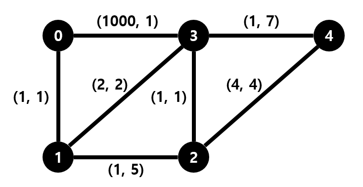
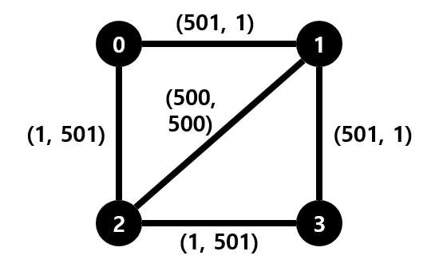

## 문제

“Kaka Is You” 라는 퍼즐 게임이 알게 모르게 인디 게이머 사이로 인기를 끌고 있다. 현식이도 예외는 아니였다. 현식이는 끙끙거리며 밤새 퍼즐을 풀다가 잠에 들었다. 눈을 떴더니, 눈 앞에 “Kaka Is You”의 등장동물 Kaka와 Bebe가 잔뜩 보이기 시작 했다. 현식이는 생각했다.

‘아니, 이건 꿈이야! 내가 꿈 속에서까지 Kaka와 Bebe를 봐야해?’

그런데, 저 멀리 탈출구가 보인다. 분명 저 탈출구로 나가면 꿈에서 깨어날 수 있을 것이다.

현재 현식이의 상황은 다음과 같다. 정점 *N*개로 구성된 그래프가 주어진다. 각 정점은 0번부터 *N* − 1번까지 번호가 붙어있고, 현식이는 정점 0번, 탈출구는 정점 *N* − 1번에 있다. 간선은 모두 양방향이며, 총 *M*개가 있다. 각 간선 또한 0번부터 *M* −1번까지 번호가 붙어있고, *i* 번 간선 위에는 Kaka가 *c*i마리, Bebe가 *d*i마리가 있다. ci와 di는 모두 1 이상 1,000 이하이다. 즉, 모든 간선마다 Kaka와 Bebe가 한 마리씩은 있다. 으악!

현식이는 다음 조건을 만족하는 0번 정점에서 *N* − 1번 정점까지의 경로를 찾아 탈출구로 나가야 한다.

1. 경로에 있는 Kaka의 총 마리 수와 Bebe의 총 마리 수는 각각 1,000을 넘어서는 안 된다.
2. 해당 경로의 스트레스는 (Kaka의 총 마리 수)×(Bebe의 총 마리 수)로 정의된다. 만약 1번을 만족하는 경로가 여러 개가 있다면 그 중 스트레스가 가장 적은 경로를 선택한다.

위 그림은 첫 번째 예시를 표현한 것이다. 각 간선의 (*a*, *b*)는 (*c*i, *d*i)를 표현한 것이다. 보다시피, 0번과 3번을 잇는 간선을 지나게 되면 어떠한 형태로든 Kaka의 총 마리 수 가 1,000을 넘어가게 되므로 지나가면 안 된다. 가능한 경로 중 가장 스트레스가 적은 경로 는 0번, 1번, 3번, 4번 순서대로 지나가는 경로이고, 스트레스 값은 (1+2+1)×(1+2+7) = 40이다.

위 그림은 두 번째 예시를 표현한 것이다. 두 번째 예시는 어떠한 경로로 가도 Kaka나 Bebe의 마리 수가 1,000을 넘어가게 되므로 가능한 답이 없다. 그러므로 -1을 출력한다.

## 입력

첫 번째 줄에 정점의 개수 *N* 과 간선의 개수 *M* 이 띄어쓰기를 사이에 두고 주어진다. (2 ≤ *N* ≤ 1,000, 1 ≤ *M* ≤ 10,000)

두 번째 줄부터 *M* + 1번째 줄까지, (1 + *i*) 번째 줄에 *i* 번 간선의 정보 *a*i, *b*i, *c*i, *d*i 값이 띄어쓰기를 사이에 두고 주어진다. 이는 *a*i 번과 *b*i 번 정점을 잇는 간선이 존재하며, 그 위에 *c*i 마리의 Kaka와 *d*i 마리의 Bebe가 있다는 뜻이다. (0 ≤ *a*i, *b*i < *N*, 1 ≤ *c*i, *d*i ≤ 20,000)

두 정점을 잇는 간선은 두 개 이상 존재하지 않는다.

## 출력

문제의 조건을 만족하는 경로의 스트레스 값 ((Kaka의 총 마리 수)×(Bebe의 총 마리 수))을 출력하라.

만약 그러한 경로가 존재하지 않는다면 -1을 출력하라.

## 힌트

첫 번째 예시에서, 0번과 3번을 잇는 간선을 지나게 되면 어떠한 형태로든 Kaka의 총 마리 수 가 1,000을 넘어가게 되므로 지나가면 안 된다. 가능한 경로 중 가장 스트레스가 적은 경로 는 0번, 1번, 3번, 4번 순서대로 지나가는 경로이고, 스트레스 값은 (1 + 2 + 1) × (1 + 2 + 7) = 40이다.

두 번째 예시는 어떠한 경로로 가도 Kaka나 Bebe의 마리 수가 1,000을 넘어가게 되므로 가능한 답이 없다. 그러므로 -1을 출력한다.
